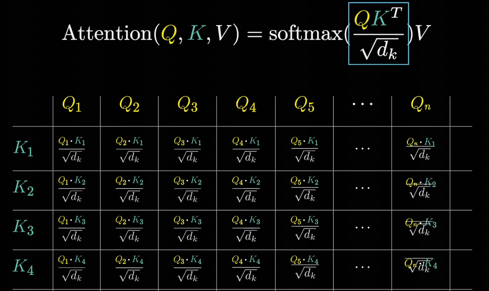

# 基本概念

一次聊天token组成：system prompt+用户问题+rules+对话历史+工具调用花费的token

IDE在的代码库检索Codebase Indexing，就是对整个代码仓库做RAG（将代码转换为可搜索的向量）

Token：一个代表字词的编号，1个Token约等于1.5-2个汉字

tokenizer：将文本转换为token。一个tokenizer认识的所有token数量为词表大小Vocab size

文本模型的Input和Output的总和长度不能超过模型的最大上下文长度

SoTA：state of the art的缩写，在AI领域指的是在特定任务领域中最先进的模型

xxxK上下文中的K：1024

Benchmark：大模型的基础测试，用于评估大模型性能的一系列标准化任务、数据集、评价指标

模型压测：性能测试、功能测试、精度测试

部署后模型的一次推理响应分为下面两个阶段，

预填充阶段：处理用户输入的整个提示词，生成第一个输出词元，这是一个计算密集型过程

解码阶段：基于已生成的词元，逐个预测并生成后续词元，这是一个内存带宽密集型过程

模型部署后用来衡量模型推理速度、吞吐量的关键性能指标：

TPM：Tokens Per Minute，每分钟处理的总词元数（包括输入输出）

RPM：Requests Per Minute，每分钟处理的请求数量

TTFT：Time To First Token，从用户发送完整请求到收到模型生成的第一个词元所花费的时间，对应预填充阶段，TTFT越短用户感觉响应越快

TPOT：Time Per Output Token，从收到第一个词元开始，到后续每个词元输出的平均生成时间，对应解码阶段，TPOT越低输出流式感越强

以下两个指标剥离了系统排队与并发干扰，用于评估模型的理论极限性能

No-load TTFT：无负载首词元时间，在系统完全空闲情况下测得的TTFT

No-load TPOT：无负载单请求词元时间，在系统完全空闲情况下测得的TPOT

Mass：Model as a service，模型即服务，自己公司将模型部署好，提供接口给外人使用从而盈利

B：十亿，8B、10B这些是用来描述模型参数量

每个参数的精度系数为该参数在计算机内存中所占用的字节数，有如下几种

FP32全精度，每个参数占用4字节4B

FP16/BF16半精度，每个参数占用2字节2B

INT8八位量化，每个参数占1字节1B，

INT4四位量化，每个参数占0.5字节0.5B

一个模型的显存占用为：参数量*精度系数


# 公司

Meta：旗下产品有Facebook、Instagram，大模型为开源的Llama系列

Google：旗下产品Google、YouTube、Android，大模型为闭源的Gemini系列

OpenAI：闭源GPT系列

Anthropic：闭源Claude系列

X：开源Grok系列

Moonshot：Kimi系列

Minimax：Minimax系列、海螺系列


# 基础知识

线性计算：例如wx+b，有权重参数w、偏置参数b

非线性计算：使用激活函数实现例如ReLu、sigmoid，没有任何参数

前馈神经网络（Feedforward Neural Network，简称FNN），也叫多层感知机（MultiLayer Perceptron，简称MLP）

Softmax：将(x1,x2,...xn)运用函数fn=e的x次方后，得到(x'1,x'2,...x'n)，将x'1+x'2+...+x'n相加等到sum，再将每个x'除以sum得到最终的x:(x''1,x''2,...,x''n)

正则化：为了避免模型过拟合，将loss函数改为新loss=原loss+正则化系数*(参数的绝对值之和/参数的平方和)，其中参数的绝对值之和/参数的平方和为惩罚项，惩罚项为参数的绝对值之和时称为L1正则化，惩罚项为参数的平方和时称为L2正则化

FC全连接层： 前一层的输入神经元与后一层的输出神经元全部连接

CNN卷积层：使用卷积核，用于处理静态数据，例如图片

Pool池化层：对卷积层后的特征图像降维，减少计算量

RNN循环神经网络：用于处理动态数据，例如时间序列、文本、语音、视频。以一个文本为例，第一个词x1先和权重矩阵Wxh1计算得到隐藏状态h1，h1与权重矩阵Why1计算得到第一个词的输出结果y1。将第二个词x2与权重矩阵Wxh2计算的结果与第一个词的隐藏状态h1与权重矩阵Whh2计算结果综合计算得到第二个词的隐藏状态h2，h2与权重矩阵Why2计算得到第二个词的输出y2。之后同理。这样就建立起了词之间的先后顺序

但是RNN任然存在1.信息随着时间步数增加而逐渐丢失，无法捕捉长期依赖；2.必须按顺序处理，每个时间步依赖上一个时间步的隐藏状态，无法并行计算的问题。

为了解决上述问题，引入了GRU、LSTM，但是不能根治

模型压缩

量化：将模型中的高精度参数转化为低精度表示，从而节省空间、提高计算效率

蒸馏

剪枝

Lora

多模态：当输入一段文本和一张图片给语言模型时，图像通过图像编码器变为一个向量，文本通过文本编码器变为一个向量，然后进行模态对齐，即让图片、文字在同一个语义向量空间中对齐（因为在文本向量空间与图像向量空间不是对齐的，图片编码后的向量放在文本向量空间中可能和毫无关联的词靠近，这样直接将文本、图片编码后的向量输入到语言模型中肯定有问题；模态对齐后，狗这个的词对应的文本向量与狗的图片对应的向量是靠近的），将对齐后图片、文本向量再放入到语言模型中得到输出

MoE：混合专家模型

# 文生图原理

以StableDffusion为例：

架构：CLIP中的文本编码器——>扩散模型——>VAE中的图像解码器

将输入文本经过文本编码器编码为向量， 扩散模型根据文本向量指引将一张有噪音的图片去噪，经过多次迭代后得到清晰的图像，最终经过图像解码器将得到的图像放到到正常尺寸。

其中扩散模型去噪过程可以简化为模型计算噪音的过程，早期使用的是UNet，之后逐渐替换为Transformer，现在有Transformer构成的Dffusion模型也称为DiT。训练过程为先准备一堆图文对，给图片一步一步加噪音，用加噪后的图片、文本作为输入，模型计算后得到噪音值，与我们实际加的噪音比较计算loss，进而反向传播训练网络

> VAE：输入一张图片，经过图像编码器得到一个向量，再输入到图像解码器中生成图像，尽可能让生成的图像与输入的图像接近，其目标是使用一个小向量表示出输入的大图像


## 训练（正向传播与反向传播）

以y=wx+b为例，其中w，b为模型参数

首先给模型参数w，b赋随机值。然后取出一个训练集中的数据x1,y1，将x1带入到y=wx+b中计算得到y2，使用平方差(y2-y1)的平方，即wx1+b-y1的平方作为损失函数loss，让loss对w、b求偏导更新w’=w-loss对w的偏导(梯度)*学习率，不断调参w、b使得loss变小，得到最终参数w、b。由于w、b都是沿着梯度反方向（损失函数减小的方向）更新，所以也叫梯度下降法

实际上，我们一般是用一批训练集的数据进行训练的。一批训练数据得到一批loss，再计算这批loss的均值作为这批数据的loss（即MSE方法），用这个平均loss对w、b求偏导更新w、b

> 其中，通过数据训练出来的参数w、b为模型参数，学习率learn rate、一次训练的数据量batch size、训练轮次epoch、正则化系数这种我们手动设定的参数为超参数。
>
> 其中，将x1带入到y=wx+b中计算得到y2，这个过程就是前向传播；由loss对w、b求偏导更新w、b，这个过程就是反向传播


## 计算一个网络结构中的参数

一个网络结构如下


第一层输入1维，输出128维。可以看成输入一个x，输出128个y，每个y对应一个线性函数y=f(x)，每个f(x)有一个权重参数w、一个偏置参数b。总共128个线性函数，那么就有128个权重参数、128个偏置参数，共计128+128=256个参数

第二层输入128维，输出256维。可以看出输入128个x，输出256个y，每个y对应一个线性函数y=f(x1,x2,...,x128)，每个函数对应128个权重参数、1个偏置参数。总共256个函数，那么就有128*256=32,768个权重参数，256个偏置参数，共计32768+256=33,024个参数

第三层输入256维，输出1维。可以看出输出256个x，输出1个y，每个y对应一个线性函数y=f(x1,x2,...,x256)，每个函数对应256个权重参数、1个偏置参数。总共1个函数，那么就有256个权重参数，1个偏置参数，共计257个参数

综上，模型总共有256+33024+257=33537个参数


# 注意力机制

几个不同句子中的同一个token向量化（Input Embedding）得到的嵌入向量都是同一个泛型向量 ，没有参考上下文，只包含这个词本身的含义

通过位置编码（Positional Encoding），在向量中加入位置信息

通过Attention获取到了周围的信息后，各个泛型向量移动位置变为包含了上下文语境的向量

Attention例子：

一个名词问"我前面有形容词吗？"，这形成一个查询；前面的形容词回答"有的，我在这。"，这形成一个回答键

使用查询矩阵Wq（模型参数）与所有token的嵌入向量相乘得到每个token的查询向量Q 

使用键矩阵Wk（模型参数）与所有token的嵌入向量相乘得到每个token的回答键向量K

计算所有token的查询向量与所有token的回答键的点积（点积后在除以查询-回答键空间维度的平方根），值越大说明查询与回答键的越相关

掩码：因为transformer是预测当前词后面一个词的，要避免后面的词影响前面的词看到答案，所有将当前矩阵左下角（后面token的回答键与前面token的查询的点积）置为负无穷，softmax后就变为0

逐列将值进行Softmax进行归一化（一列中所有值之和为1，每个值介于0-1之间）




# transformer


起初是用来做文本翻译的

## 工作原理

左侧灰色文本框内是一个编码器（将文本编码为高层次数字矩阵表示），一共有n个，前一个编码器的输出作为后一个编码器的输入。整体表现为输入一段文本（我是曾），经过计算后最终得到一个数字含义矩阵（这个矩阵可以理解为我是曾的一个高层概括）。

右侧灰色文本框内是一个解码器，一共有n个，接收编码器输出的含义矩阵、上一个解码器的输出。整体表现为输入编码器输出的含义矩阵、开始标记，经过计算后将得到的结果在传入到Linear、Softmax中，最终生成第一个token的分布概率（模型认识的每个token都有一个概率），选择概率最高的token作为第一个输出。之后将含义矩阵、开始标记+第一个token输入再走一次解码器，得到第二个token。一直循环往复，知道输出结束标记时停止，得到最终生成的token序列

每生成一个最终token就要将解码器完整跑一遍，可以看出解码器输出token的工作量远大于编码器

在Softmax的概率分布中，我们每次选择概率最高的token作为输出，所以对于相同的含义矩阵（输入文本）生成的token序列都是相同的。我们可以设置一些参数让模型更有创造性：比如temperature温度，让其选择其他概率的token，为0时表示选择概率最高的token；Top-K，从前K个token中选择

transformer模型训练是监督学习SFT，需要成对的翻译前后的文本

编码器主要负责理解文字，Google将解码器删除，剩下encode部分，形成encoder-only transformer，这就是Bert的模型架构，适合提取文字中的信息

解码器主要负责生成文字，OpenAI将解码器中和含义矩阵相关的部分全部删除，剩下decoder部分，形成decoder-only transformer，这就是GPT2的模型结构，适合做文字接龙，训练时只需要提供输入即可，进行自监督学习

**内部细节**

线性变化：多头注意力层、前馈神经网络（Feedforward Neural Network，简称FNN）、掩码多头注意力层、线性层

**注意力机制Attention**

多头注意力Multi-Head Attention：每个头只关注嵌入向量某一个维度特征


# 推理引擎

类比web应用，写好的代码不能直接运行，需要借助nginx部署到web服务器上。而训练得到的模型文件类比写好的代码，需要借助推理引擎运行。


# 强化学习RL（Reinforcement learing）

DQN（Deep Q-Networks）

TRPO（Trust Region Policy Optmization）

近端策略优化PPO（Proximal Policy Optimization）


# 智能体与工作流

智能体：大模型根据任务需求自主规划执行流程、工具调用，独立完成一项任务的系统

工作流：通过预定的流程来协调大模型与工具的系统，大模型只是工作流中的一个组件，只能按照预设的流程走


# claude code

```bash
# 查看可用的子agent
/agents

# 终端对话引用图像
# 1.拖拽图片到cli；2.复制图片后粘贴到cli；3.在cli中提供图片路径

# 引用文件、目录、子agents
# 通过@符引用

```

## 子agent

### 内置子agent

Explore：使用便宜的Haiku模型快速、只读地搜索分析代码库

Plan：继承主对话的模型，只读模式对代码进行规划

General-purpose：继承主对话的模型，可读可写处理任务

Bah：继承主对话的模型，当在单独的上下文中运行终端命令时调用

statusline-setup：使用Sonnet模型，当运行 `/statusline` 来配置状态行时调用

Claude Code Guide：使用Haiku模型，当提出关于Claude Code功能的问题时调用

### 创建自定义子agent

通过/agents命名创建，或者书写带有YAML前置元数据的MD文件

全局个人agents：所有项目都可以使用的agents，存放在`~/.claude/agents/`下

项目agents：仅当前项目可以使用的agents，存放在每个项目的`.claude/agents`下


# Prompt

**System prompt：**描述当前AI的角色、性格、背景信息等定位（非用户想直接发生的消息）

**User prompt：**用户想直接询问的问题，发送给AI的话


# Function Call

Function Call 是一种实现 LLM 连接外部工具的机制。调用 LLM 时，调用方描述函数（包括函数的功能描述、请求参数说明、响应参数说明），LLM 根据用户的输入，选择调用某个函数，并将用户的自然语言转换为调用函数的请求参数，函数名与参数通过 JSON 格式返回给调用方。调用方使用 LLM 返回的函数名称和参数，调用函数并得到响应，之后将响应传给 LLM，从而获得自然语言的回答

**大模型的function call能力是如何获得的？**

对基础模型进行sft获得，教会LLM两件事：识别意图（理解用户的请求是否需要借助外部工具/函数来完成，而不是直接生成文本回答）、参数提取与格式化（如果需要调用函数，要正确地从用户请求中抽取出所需的参数，并按照预先定义的格式（通常是json）生成函数调用的指令）

sft的过程如下：

- 步骤 1：数据集构建：构建包含 Function Calling 场景的指令微调数据集，每条数据样本包含用户输入（可能需调用函数或直接回答的请求）、可用函数 / 工具描述（函数用途、参数类型等结构化文本）、期望输出（需调用函数时为含函数名与参数的 Json，否则为文本回答）。
- 步骤 2：选择基础模型：选用具有指令遵循能力的预训练大模型（如 Llama、GPT、Qwen 等）。
- 步骤 3：格式化训练数据：将 “用户输入” 与 “可用函数描述” 拼接为模型输入（Prompt），“期望输出”（Json 函数调用或文本回答）作为目标输出（Completion/Target）。
- 步骤 4：进行微调：使用标准 SFT 方法（全参数微调或 PEFT 如 LoRA）在数据集上训练，优化目标为最小化预测输出与期望输出的差异（如交叉熵损失），使模型学会根据输入与函数描述，决定直接回答或生成特定格式的函数调用 Json。


# MCP

**MCP定义了一套标准化的工具发现、调用和管理机制， 它规定了应用程序之间如何通信**

## 通信方式

stdio（**st**an**d**ard **i**nput and **o**utput 标准输入输出）：推荐，高效、简洁、本地


http：可远程

## 通信格式

基于JSON-RPC的进一步规范

JSON-RPC：一种远程过程调用（RPC，Remote Procedure Call）协议，使用Json作为数据格式，通过网络调用远程服务器上的方法

## MCP与function call的区别

MCP支持动态工具发现，模型可以在运行时发现新的可用工具，无需重新训练或部署。function calling需要将工具函数直接集成到模型代码中，工具更新需要重新部署整个系统

MCP提供了标准化的工具接口定义，包括工具名称、描述、参数格式、返回值等，确保工具调用的规范性。function calling缺乏标准化的工具管理机制，不同工具的参数格式、返回值格式可能不一致

MCP支持跨应用的工具共享，一个MCP服务器可以被多个客户端使用。function calling只能在单个应用中使用


# RAG

## 索引Index

步骤：

将知识内容分割Split

嵌入Embedding：使用嵌入模型将文本内容转换为一个嵌入向量，核心逻辑就是将文本token化，对每个token计算其嵌入向量，将文本对应的所有嵌入向量池化得到一个平均嵌入向量

存储Storage：存储嵌入结果到向量数据库

## 检索Retrieval

将用户的问题与建立的索引进行匹配，得到相关度高的结果

## 生成Generation

将匹配到的知识与用户问题混合给LLM，得到最终结果


# Rules


# Skills

**skill的组成：**一个skill技能对应一个文件夹，一个技能通常包含skill.md文件、相应的文档、可运行脚本

**skill.md的组成：**skill.md文件为该技能的说明，由yaml头（技能名称、技能间接描述）、md格式的详细技能使用描述（在描述中又可以引用当前skill下其他文档、可运行脚本或者其他skill）组成。

**解决了token有限问题：**yaml头文件少，总是会被加载到上下文中；md格式的技能描述在AI认为需要使用该skill时触发加载，文件体积大小适中；AI使用该skill时按需使用描述中引用的当前skill下其他文档、可运行脚本或者其他skill。这样解决了上下文token受限的问题，避免了一个工具放在上下文中就占用大量token

## 与MCP的区别

skills是AI的行为规范层，负责帮AI固定化专业流程完成任务（期间可以通过MCP连接外部系统来完成工作）；MCP是Agent与外部系统的标准化交互接口，负责AI连接外部世界（Agent连接数据库、github等）

skills就是简单的md文件；MCP创建需要编程、服务器配置

skills是渐进式加载按需加载工具；MCP在启用时就需要加载该MCP下所有工具

