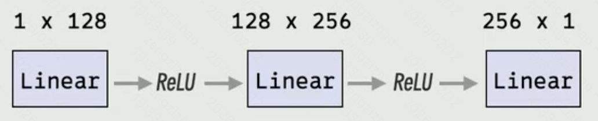
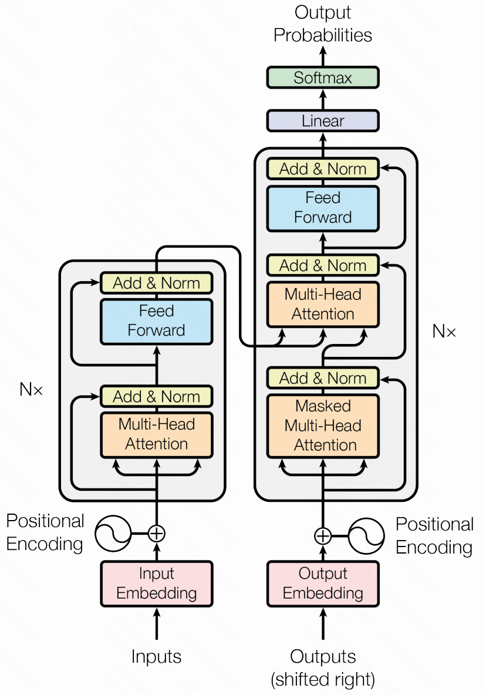

# 基本概念

一次聊天token组成：system prompt+用户问题+rules+对话历史+工具调用花费的token

IDE在的代码库检索Codebase Indexing，就是对整个代码仓库做RAG（将代码转换为可搜索的向量）

Token：1个Token约等于1.5-2个汉字

文本模型的Input和Output的总和长度不能超过模型的最大上下文长度

SoTA：state of the art的缩写，在AI领域指的是在特定任务领域中最先进的模型

xxxK上下文中的K：1024

Benchmark：大模型的基础测试，用于评估大模型性能的一系列标准化任务、数据集、评价指标

模型压测：性能测试、功能测试、精度测试

部署后模型的一次推理响应分为下面两个阶段，

预填充阶段：处理用户输入的整个提示词，生成第一个输出词元，这是一个计算密集型过程

解码阶段：基于已生成的词元，逐个预测并生成后续词元，这是一个内存带宽密集型过程

模型部署后用来衡量模型推理速度、吞吐量的关键性能指标：

TPM：Tokens Per Minute，每分钟处理的总词元数（包括输入输出）

RPM：Requests Per Minute，每分钟处理的请求数量

TTFT：Time To First Token，从用户发送完整请求到收到模型生成的第一个词元所花费的时间，对应预填充阶段，TTFT越短用户感觉响应越快

TPOT：Time Per Output Token，从收到第一个词元开始，到后续每个词元输出的平均生成时间，对应解码阶段，TPOT越低输出流式感越强

以下两个指标剥离了系统排队与并发干扰，用于评估模型的理论极限性能

No-load TTFT：无负载首词元时间，在系统完全空闲情况下测得的TTFT

No-load TPOT：无负载单请求词元时间，在系统完全空闲情况下测得的TPOT

Mass：Model as a service，模型即服务，自己公司将模型部署好，提供接口给外人使用从而盈利


# 公司

Meta：旗下产品有Facebook、Instagram，大模型为开源的Llama系列

Google：旗下产品Google、YouTube、Android，大模型为闭源的Gemini系列

OpenAI：闭源GPT系列

Anthropic：闭源Claude系列

X：开源Grok系列

Moonshot：Kimi系列

Minimax：Minimax系列、海螺系列


# 基础知识

线性层：例如wx+b，有权重参数w、偏置参数b

激活函数（非线性计算）：ReLu、sigmoid，没有任何参数

前馈神经网络（Feedforward Neural Network，简称FNN），也叫多层感知机（MultiLayer Perceptron，简称MLP）

## 计算一个网络结构中的参数

一个网络结构如下



第一层输入1维，输出128维。可以看成输入一个x，输出128个y，每个y对应一个线性函数y=f(x)，每个f(x)有一个权重参数w、一个偏置参数b。总共128个线性函数，那么就有128个权重参数、128个偏置参数，共计128+128=256个参数

第二层输入128维，输出256维。可以看出输入128个x，输出256个y，每个y对应一个线性函数y=f(x1,x2,...,x128)，每个函数对应128个权重参数、1个偏置参数。总共256个函数，那么就有128*256=32,768个权重参数，256个偏置参数，共计32768+256=33,024个参数

第三层输入256维，输出1维。可以看出输出256个x，输出1个y，每个y对应一个线性函数y=f(x1,x2,...,x256)，每个函数对应256个权重参数、1个偏置参数。总共1个函数，那么就有256个权重参数，1个偏置参数，共计257个参数

综上，模型总共有256+33024+257=33537个参数

Softmax

ex


# transformer



起初是用来做文本翻译的

## 工作原理

左侧灰色文本框内是一个编码器（将文本编码为高层次数字矩阵表示），一共有n个，前一个编码器的输出作为后一个编码器的输入。整体表现为输入一段文本（我是曾），经过计算后最终得到一个数字含义矩阵（这个矩阵可以理解为我是曾的一个高层概括）。

右侧灰色文本框内是一个解码器，一共有n个，接收编码器输出的含义矩阵、上一个解码器的输出。整体表现为输入编码器输出的含义矩阵、开始标记，经过计算后将得到的结果在传入到Linear、Softmax中，最终生成第一个token的分布概率（模型认识的每个token都有一个概率），选择概率最高的token作为第一个输出。之后将含义矩阵、开始标记+第一个token输入再走一次解码器，得到第二个token。一直循环往复，知道输出结束标记时停止，得到最终生成的token序列

每生成一个最终token就要将解码器完整跑一遍，可以看出解码器输出token的工作量远大于编码器

在Softmax的概率分布中，我们每次选择概率最高的token作为输出，所以对于相同的含义矩阵（输入文本）生成的token序列都是相同的。我们可以设置一些参数让模型更有创造性：比如temperature温度，让其选择其他概率的token，为0时表示选择概率最高的token；Top-K，从前K个token中选择

transformer模型训练是监督学习SFT，需要成对的翻译前后的文本

编码器主要负责理解文字，Google将解码器删除，剩下encode部分，形成encoder-only transformer，这就是Bert的模型架构，适合提取文字中的信息

解码器主要负责生成文字，OpenAI将解码器中和含义矩阵相关的部分全部删除，剩下decoder部分，形成decoder-only transformer，这就是GPT2的模型结构，适合做文字接龙，训练时只需要提供输入即可，进行自监督学习

**内部细节**

线性变化：多头注意力层、前馈神经网络（Feedforward Neural Network，简称FNN）、掩码多头注意力层、线性层


# 模型参数

B：十亿，8B、10B这些是用来描述模型参数量

每个参数的精度系数为该参数在计算机内存中所占用的字节数，有如下几种

FP32全精度，每个参数占用4字节4B

FP16/BF16半精度，每个参数占用2字节2B

INT8八位量化，每个参数占1字节1B，

INT4四位量化，每个参数占0.5字节0.5B

一个模型的显存占用为：参数量*精度系数


# 推理引擎

类比web应用，写好的代码不能直接运行，需要借助nginx部署到web服务器上。而训练得到的模型文件类比写好的代码，需要借助推理引擎运行。


# 强化学习RL（Reinforcement learing）

DQN（Deep Q-Networks）

TRPO（Trust Region Policy Optmization）

近端策略优化PPO（Proximal Policy Optimization）


# agent智能体与workflow工作流

智能体：大模型根据任务需求自主规划执行流程、工具调用，独立完成一项任务的系统

工作流：通过预定的流程来协调大模型与工具的系统，大模型只是工作流中的一个组件，只能按照预设的流程走

## 工作流


# claude code

```bash
# 查看可用的子agent
/agents

# 终端对话引用图像
# 1.拖拽图片到cli；2.复制图片后粘贴到cli；3.在cli中提供图片路径

# 引用文件、目录、子agents
# 通过@符引用

```

## 子agent

### 内置子agent

Explore：使用便宜的Haiku模型快速、只读地搜索分析代码库

Plan：继承主对话的模型，只读模式对代码进行规划

General-purpose：继承主对话的模型，可读可写处理任务

Bah：继承主对话的模型，当在单独的上下文中运行终端命令时调用

statusline-setup：使用Sonnet模型，当运行 `/statusline` 来配置状态行时调用

Claude Code Guide：使用Haiku模型，当提出关于Claude Code功能的问题时调用

### 创建自定义子agent

通过/agents命名创建，或者书写带有YAML前置元数据的MD文件

全局个人agents：所有项目都可以使用的agents，存放在`~/.claude/agents/`下

项目agents：仅当前项目可以使用的agents，存放在每个项目的`.claude/agents`下


# Prompt

**System prompt：**描述当前AI的角色、性格、背景信息等定位（非用户想直接发生的消息）

**User prompt：**用户想直接询问的问题，发送给AI的话


# Function Call


# MCP


# RAG

## 索引Index

步骤：

将知识内容分割Split

嵌入Embedding：使用嵌入模型将文本内容转换为一个嵌入向量，核心逻辑就是将文本token化，对每个token计算其嵌入向量，将文本对应的所有嵌入向量池化得到一个平均嵌入向量

存储Storage：存储嵌入结果到向量数据库

## 检索Retrieval

将用户的问题与建立的索引进行匹配，得到相关度高的结果

## 生成Generation

将匹配到的知识与用户问题混合给LLM，得到最终结果


# Rules


# Skills

**skill的组成：**一个skill技能对应一个文件夹，一个技能通常包含skill.md文件、相应的文档、可运行脚本

**skill.md的组成：**skill.md文件为该技能的说明，由yaml头（技能名称、技能间接描述）、md格式的详细技能使用描述（在描述中又可以引用当前skill下其他文档、可运行脚本或者其他skill）组成。

**解决了token有限问题：**yaml头文件少，总是会被加载到上下文中；md格式的技能描述在AI认为需要使用该skill时触发加载，文件体积大小适中；AI使用该skill时按需使用描述中引用的当前skill下其他文档、可运行脚本或者其他skill。这样解决了上下文token受限的问题，避免了一个工具放在上下文中就占用大量token

## 与MCP的区别

skills就是简单的md文件；mcp创建需要编程、服务器配置

skills是渐进式加载按需加载工具；mcp在启用时就需要加载该mcp下所有工具

