# 基本概念

一次聊天token组成：system prompt+用户问题+rules+对话历史+工具调用花费的token

IDE在的代码库检索Codebase Indexing，就是对整个代码仓库做RAG（将代码转换为可搜索的向量）

Token：一个代表字词的编号，1个Token约等于1.5-2个汉字

Tokenizer分词器：将文本序列转换为数字序列（token编号）。tokenizer有一个预设的词汇库，记录了认识的所有token，使用tokenizer参考词汇库分割句子为一串token

文本模型的Input和Output的总和长度不能超过模型的最大上下文长度

SoTA：state of the art的缩写，在AI领域指的是在特定任务领域中最先进的模型

xxxK上下文中的K：1024

Benchmark：大模型的基础测试，用于评估大模型性能的一系列标准化任务、数据集、评价指标

模型压测：性能测试、功能测试、精度测试

部署后模型的一次推理响应分为下面两个阶段，

预填充阶段：处理用户输入的整个提示词，生成第一个输出词元，这是一个计算密集型过程

解码阶段：基于已生成的词元，逐个预测并生成后续词元，这是一个内存带宽密集型过程

模型部署后用来衡量模型推理速度、吞吐量的关键性能指标：

TPM：Tokens Per Minute，每分钟处理的总词元数（包括输入输出）

RPM：Requests Per Minute，每分钟处理的请求数量

TTFT：Time To First Token，从用户发送完整请求到收到模型生成的第一个词元所花费的时间，对应预填充阶段，TTFT越短用户感觉响应越快

TPOT：Time Per Output Token，从收到第一个词元开始，到后续每个词元输出的平均生成时间，对应解码阶段，TPOT越低输出流式感越强

以下两个指标剥离了系统排队与并发干扰，用于评估模型的理论极限性能

No-load TTFT：无负载首词元时间，在系统完全空闲情况下测得的TTFT

No-load TPOT：无负载单请求词元时间，在系统完全空闲情况下测得的TPOT

Mass：Model as a service，模型即服务，自己公司将模型部署好，提供接口给外人使用从而盈利

B：十亿，8B、10B这些是用来描述模型参数量

每个参数的精度系数为该参数在计算机内存中所占用的字节数，有如下几种

FP32全精度，每个参数占用4字节4B

FP16/BF16半精度，每个参数占用2字节2B

INT8八位量化，每个参数占1字节1B，

INT4四位量化，每个参数占0.5字节0.5B

一个模型的显存占用为：参数量*精度系数


# 公司

Meta：旗下产品有Facebook、Instagram，大模型为开源的Llama系列

Google：旗下产品Google、YouTube、Android，大模型为闭源的Gemini系列

OpenAI：闭源GPT系列

Anthropic：闭源Claude系列

X：开源Grok系列

Moonshot：Kimi系列

Minimax：Minimax系列、海螺系列


# 基础知识

**线性计算：**例如wx+b，有权重参数w、偏置参数b

**非线性计算：**使用激活函数实现例如ReLu、sigmoid，没有任何参数

**Softmax：**将(x1,x2,...xn)运用函数fn=e的x次方后，得到(x'1,x'2,...x'n)，将x'1+x'2+...+x'n相加等到sum，再将每个x'除以sum得到最终的x:(x''1,x''2,...,x''n)。把任意数列转换为概率分布

**梯度消失：**

模型参数更新靠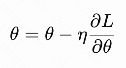，如果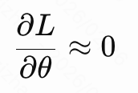，那么参数几乎不更新，这就是梯度消失即梯度为0

例如一个神经网络每层的导数都是 0.5。反向传播时梯度要连乘：0.5的10次方为0.000976，0.5的50次方几乎为 0。前面的层根本学不到东西。

**梯度爆炸：**

如果梯度非常大，导致参数更新过大，这就是梯度爆炸即梯度很大

例如一个神经网络每层导数都是 2。反向传播是梯度要连乘：2的10次方为1024，2的50次方已经非常大了。导致前面的层参数更新过大

> 梯度消失、梯度爆炸的根本原因是连乘

**正则化：**为了避免模型过拟合，将loss函数改为新loss=原loss+正则化系数*(参数的绝对值之和/参数的平方和)，其中参数的绝对值之和/参数的平方和为惩罚项，惩罚项为参数的绝对值之和时称为L1正则化，惩罚项为参数的平方和时称为L2正则化

**FC全连接层：** 前一层的输入神经元与后一层的输出神经元全部连接

**CNN卷积层：**使用卷积核，用于处理静态数据，例如图片

**Pool池化层：**对卷积层后的特征图像降维，减少计算量

**残差连接：**本层网络输出=输入x在本层的输出 + 输入x，即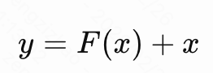

能够缓解梯度消失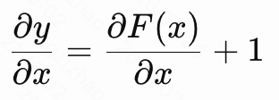，因为即使F(x)的导数很小，但是由于有1的存在，梯度不会很小

**RNN循环神经网络：**用于处理动态数据，例如时间序列、文本、语音、视频。

以一个文本为例，t1时刻第一个词x1乘权重矩阵Wx的结果与初始化隐藏状态h0乘权重矩阵U的结果相加经过激活函数得到隐藏状态h1，h1乘权重矩阵V的结果经过激活函数得到第一个词的输出结果y1。（一个token对应两个输出：一个是隐藏状态h，用于给后面的token传递当前token的信息；一个是当前token的实际输出）

将第二个词x2与权重矩阵Wx计算的结果与第一个词的隐藏状态h1与权重矩阵Whh2计算结果综合计算得到第二个词的隐藏状态h2，h2与权重矩阵Why2计算得到第二个词的输出y2。之后同理。这样就建立起了词之间的先后顺序。公示如下

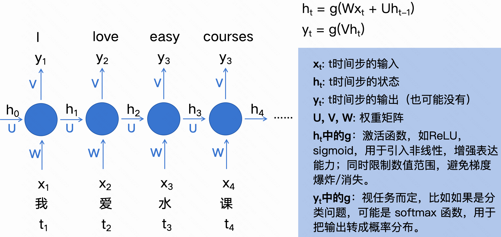

但是RNN任然存在1.信息随着时间步数增加而逐渐丢失，无法捕捉长期依赖；2.必须按顺序处理，每个时间步依赖上一个时间步的隐藏状态，无法并行计算的问题。

为了解决上述问题，引入了GRU、LSTM，但是不能根治

**预训练：**通过自监督学习从大规模数据中获得与具体任务无关的预训练模型

**微调：**在预训练模型基础上，使用特定数据集对模型进一步训练，使其适应特定任务

**Lora**

**模型压缩**

**量化：**将模型中的高精度参数转化为低精度表示，从而节省空间、提高计算效率

**蒸馏**

**剪枝**

**多模态：**当输入一段文本和一张图片给语言模型时，图像通过图像编码器变为一个向量，文本通过文本编码器变为一个向量，然后进行模态对齐，即让图片、文字在同一个语义向量空间中对齐（因为在文本向量空间与图像向量空间不是对齐的，图片编码后的向量放在文本向量空间中可能和毫无关联的词靠近，这样直接将文本、图片编码后的向量输入到语言模型中肯定有问题；模态对齐后，狗这个的词对应的文本向量与狗的图片对应的向量是靠近的），将对齐后图片、文本向量再放入到语言模型中得到输出

**MoE：**混合专家模型，将一个超大的Dense前馈神经网络变为一个线性层的路由和多个小的前馈神经网络，输入到路由计算每个专家的权重，由路由选出几个权重高的专家计算值，将值与权重相乘再相加得到最终输出

## 训练（正向传播与反向传播）

以y=wx+b为例，其中w，b为模型参数

首先给模型参数w，b赋随机值。然后取出一个训练集中的数据x1,y1，将x1带入到y=wx+b中计算得到y2，使用平方差(y2-y1)的平方，即wx1+b-y1的平方作为损失函数loss，让loss对w、b求偏导更新w’=w-loss对w的偏导(梯度)*学习率，不断调参w、b使得loss变小，得到最终参数w、b。由于w、b都是沿着梯度反方向（损失函数减小的方向）更新，所以也叫梯度下降法

实际上，我们一般是用一批训练集的数据进行训练的。一批训练数据得到一批loss，再计算这批loss的均值作为这批数据的loss（即MSE方法），用这个平均loss对w、b求偏导更新w、b

> 其中，通过数据训练出来的参数w、b为模型参数，学习率learn rate、一次训练的数据量batch size、训练轮次epoch、正则化系数这种我们手动设定的参数为超参数。
>
> 其中，将x1带入到y=wx+b中计算得到y2，这个过程就是前向传播；由loss对w、b求偏导更新w、b，这个过程就是反向传播


## 计算一个网络结构中的参数

一个网络结构如下

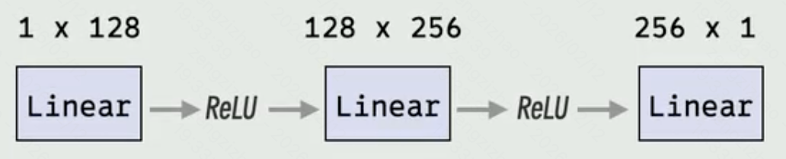

第一层输入1维，输出128维。可以看成输入一个x，输出128个y，每个y对应一个线性函数y=f(x)，每个f(x)有一个权重参数w、一个偏置参数b。总共128个线性函数，那么就有128个权重参数、128个偏置参数，共计128+128=256个参数

第二层输入128维，输出256维。可以看出输入128个x，输出256个y，每个y对应一个线性函数y=f(x1,x2,...,x128)，每个函数对应128个权重参数、1个偏置参数。总共256个函数，那么就有128*256=32,768个权重参数，256个偏置参数，共计32768+256=33,024个参数

第三层输入256维，输出1维。可以看出输出256个x，输出1个y，每个y对应一个线性函数y=f(x1,x2,...,x256)，每个函数对应256个权重参数、1个偏置参数。总共1个函数，那么就有256个权重参数，1个偏置参数，共计257个参数

综上，模型总共有256+33024+257=33537个参数

# 文生图原理

以StableDffusion为例：

架构：CLIP中的文本编码器——>扩散模型——>VAE中的图像解码器

将输入文本经过文本编码器编码为向量， 扩散模型根据文本向量指引将一张有噪音的图片去噪，经过多次迭代后得到清晰的图像，最终经过图像解码器将得到的图像放到到正常尺寸。

其中扩散模型去噪过程可以简化为模型计算噪音的过程，早期使用的是UNet，之后逐渐替换为Transformer，现在有Transformer构成的Dffusion模型也称为DiT。训练过程为先准备一堆图文对，给图片一步一步加噪音，用加噪后的图片、文本作为输入，模型计算后得到噪音值，与我们实际加的噪音比较计算loss，进而反向传播训练网络

> VAE：输入一张图片，经过图像编码器得到一个向量，再输入到图像解码器中生成图像，尽可能让生成的图像与输入的图像接近，其目标是使用一个小向量表示出输入的大图像


# 分词器tokenizer

## 分词方式

**word Level**

将文本按照单词分割成token，jieba分词就是基于这种分词方式

优点是符合人的自然语言与直觉

缺点是无法处理未登录词（Out-of-Vocabulary，简称OOV）；相同意思的单词（例如dog、dogs）被划分为不同的token；词表非常大

**Character level**

将文本按照字符分割成token

优点是没有OOV现象、西文不需要很大的词表

缺点是相对于单词信息量低，模型性能差；产生的token序列过长；中文需要很大的词表

**Subword level**

将文本按照子词分割成token

优点是保留了每个词的信息；词表大小固定

## Subword分词算法

**BPE**

BPE即Byte-Pair Encoding，基于字符，典型模型有GPT、LLaMA

算法包含两部分：词频统计、词表合并

步骤如下（超参数合并次数为n）:

步骤1：输入语料库，采用基于单词的方法对每个单词做词频统计，形成词-词频对("hug", 10), ("pug", 5), ("pun", 12), ("bun", 4), ("hugs", 5)；同时基于字符构建基本词表["b", "g", "h", "n", "p", "s", "u"]

步骤2：按照基本词表将词-词频对中每个词分割("h" "u" "g", 10), ("p" "u" "g", 5), ("p" "u" "n", 12), ("b" "u" "n", 4), ("h" "u" "g" "s", 5)

步骤3：统计每个词的词内相邻token出现频率hu:15, ug:20, pu:17, un:16, bu:4, gs: 5，将最高频对ug添加到词表中更新[“b”, “g”, “h”, 

“n”, “p”, “s”, “u”, ”ug”]

步骤4：使用刚刚添加到词表中的最高频对ug替换词-词频对("h" "ug", 10), ("p" "ug", 5), ("p" "u" "n", 12), ("b" "u" "n", 4), ("h" "ug" "s", 5)

步骤5：重复步骤3、4，直至合并次数达到n

步骤6：停止合并时的词表就是最终进行分词的词表[“b”, “g”, “h”, “n”, “p”, “s”, “u”, ”ug”, “un”,“hug”]，对于bug使用该词表分词结果为[“b”, “ug”]，mug为[“<unk>”, “ug”]

> GPT的词汇表大小为40478，因为它有478个基本字符，并且在40000次合并后停止。

BBPE即Byte-level BPE，基于字节，在BPE的基础上是256个字节的值为单位

**WordPiece**

典型模型有BERT

算法与BPE类似，区别在于1.每个单词除了首字母，后面的字母添加##的前缀；2.使用如下概率公式计算大小合并，而不是每个词的词内相邻token出现频率的大小


步骤如下：

步骤如下（超参数合并次数为n）:

步骤1：输入语料库，采用基于单词的方法对每个单词做词频统计，形成词-词频对("hug", 10), ("pug", 5), ("pun", 12), ("bun", 4), ("hugs", 5)；同时基于字符构建基本词表["b", "h", "p", "##g", "##n", "##s", "##u"]

步骤2：按照基本词表将词-词频对中每个词分割("h" "##u" "##g", 10), ("p" "##u" "##g", 5), ("p" "##u" "##n", 12), ("b" "##u" "##n", 4), ("h" "##u" "##g" "##s", 5)

步骤3：

计算每个pair出现次数"h##u":15、“##u##g”:20、“p##u”:17、“##u##n”:16、“b##u”:4、“##g##s”:5

计算每个token出现次数"h":15、“##u”:36、“##g”:20、“p”:17、“##n”:16、”b“:4、”##s“:5

计算每个pair的概率，将最高频对“\##gs”添加到词表中更新["b", "h", "p", "##g", "##n", "##s", "##u","\##gs"]

步骤4：使用刚刚添加到词表中的最高频对“\##gs”替换词-词频对("h" "##u" "##g", 10), ("p" "##u" "##g", 5), ("p" "##u" "##n", 12), ("b" "##u" "##n", 4), ("h" "##u" "##gs", 5)

步骤5：重复步骤3、4，直至合并次数达到n

步骤6：停止合并时的词表就是最终进行分词的词表

**Unigram**

与BPE、WordPiece词表由小变到大相反，Unigram是首先构建一个大词表，每次删除 p% 的使得 unigram loss 增加最少的 token（即对词表影响最少得token），迭代直到词表大小缩减到预设值，得到最终的一个小词表


# Embedding

## 静态编码

为每个词生成一个固定的向量

**Word2Vec**

一个词的含义可以通过它周围的上下文理解，可分为CBOW连续词袋、Skip-Gram跳字模型

CBOW连续词袋根据一个词周围的上下文预测词，使得模型将具有相似上下文的词映射到相近的向量

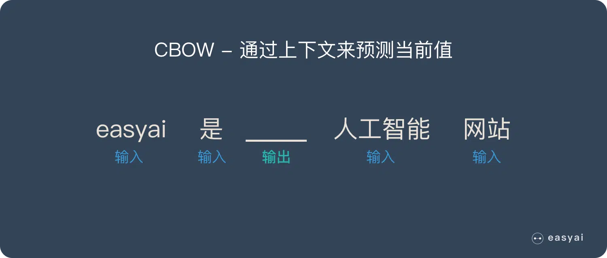

Skip-Gram跳字模型根据一个给定的目标词，预测这个词周围可能出现的上下文

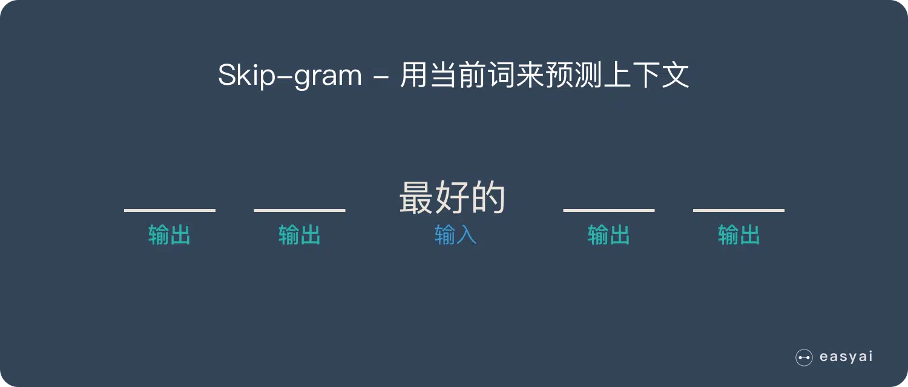

Word2Vec 的局限性在于，它为每个词生成一个单一的固定向量，无法有效处理多义词问题。例如，“bank”既可以指“银行”也可以指“河岸”，但Word2Vec 会将这两个含义混杂到同一个向量中，无法区分它们。

**FastText**

把词拆成字符级的n-gram，词向量=所有n-gram向量之和

> n-gram：将语料拆成n个词一对，使用条件概率计算某个序列后面出现的词是什么的概率。基于语料历史，看当前这种前缀文本后面通常接什么
>
> 例子：
>
> 语料为I love NLP、I love AI、You love NLP
>
> 统计单个词出现的次数 I:2、love:3、NLP:2、AI:1、You:1
>
> n=2时可以构造对子为I love、love NLP、I love、love AI、You love、love NLP
>
> 统计2个词连在一起出现的次数 I love:2、love NLP:2、love AI:1、You love:1
>
> 如果当前要预测I love ? 。根据条件概率公式
>
> 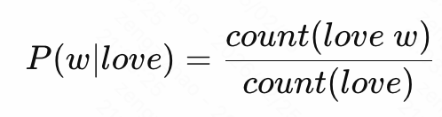
>
> love NLP出现2次，则P(NLP|love)=2/3。love AI出现1词，则P(AI|love)=1/3。其他词没有接在love后概率为0。所以可以后面是认为I love NLP

**GloVe**

GloVe全局向量，一个词含义不仅取决于其局部上下文，也取决于其在整个语料库中的全局共现频率。

## 动态编码

同一个词在不同上下文中向量不同

例如Elmo、GPT、Bert

## 经典embedding模型

### BGE

全称BAAI General Embedding，由智源研究院提出的开源通用向量模型

其训练过程分为三阶段：

**预训练**：使用RetroMAE模型架构在通用文本上预训练

**弱监督学习**：使用无标签的通用文本训练，对比学习从负样本中学习如何区分出成对的文本；

**有监督微调**：使用有标签数据在特定任务上微调

## 可视化嵌入

嵌入向量维度高达数百甚至上千维，通过降维技术将高维数据压缩到二维、三维空间，从而直观观察数据模式

### 降维技术

**t-SNE**

t-distributed stochastic neighbor embedding即t分布随机领域嵌入，一种非线性降维方法

在高维空间中，将点与点之间的相近程度转换为概率；在低维空间中定义类似概率；通过优化让低维空间的概率分布尽可能接近高维空间，从而让相邻关系保持

**UMAP**

Uniform Manifold Approximation and Projection即统一流形近似与投影，一种非线性降维方法

在高维空间中为每个点找近邻，构建一个“谁和谁相近”的近邻图；将近邻关系表示成一个带权图；通过优化，在低维关系中放置点，使得低维的近邻图与高维的近邻图一致


# 位置编码

## 绝对位置编码

位置编码通过直接相加的方式注入到文本向量中，yk=f(xk,qk)=xk+pk，可分为训练式、固定式

**训练式**

位置编码作为可训练参数一起训练

缺点是没有外推性（训练好的最大长度为n，那么最多只能处理长度为n的句子）

**固定式**

经典论文Attention is all you need中的三角函数位置编码

第 pos 个位置的编码向量在偶数位和奇数位上的分量值为：

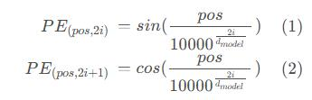

## 相对位置编码

位置编码将token间的相对位置信息注入到Attention中，Attention=QK+f(r)

**ALiBi**

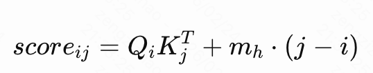

给 Attention score 加一个距离相关的线性惩罚，越远的 token，Attention 分数越被惩罚

**XLNET**

从绝对位置编码触发：qi=WQ(xi+pi)，kj=WK(xj+pj)，注意力分数为如下


将pj替换成相对位置向量Ri-j，pi替换成可训练的向量u和v


即如下

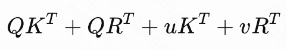

**T5**

XLNET的（7）式中的每一项可以理解为“输入-输入”、“输入-位置”、“位置-输入”、“位置-位置”四项注意力的组合，由于输入信息与位置信息应该是独立的，它们不应该有过多的交互，所以“输入-位置”、“位置-输入”两项Attention可以删掉。最终注意力分数就是输入-输入+可训练的偏置

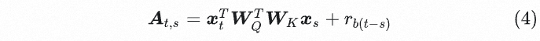

**DeBERTa**

与T5相反，扔掉“位置-位置”一项只保留前三项

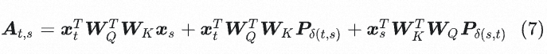

## 旋转位置编码RoPE

**什么是RoPE**

用“旋转”来编码位置，让注意力天然包含相对位置信息，不是把位置向量加到文本向量上，而是对 Q 和 K 做位置相关的旋转变换

**什么是旋转**

一个二维向量x=(x1,x2)旋转 θ 角度，得到旋转后的向量

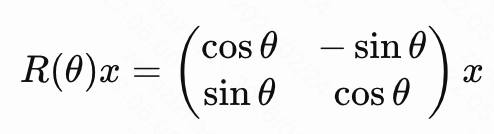

**如何注入模型**

将词向量在多维空间中“旋转”，并且旋转的角度与单词的绝对位置相关，使得两个向量在经过这种位置编码后，它们的点积只与它们之间的相对位置差有关，而与它们的绝对位置无关

原始注意力scoreij=Qi⋅Kj，RoPE后

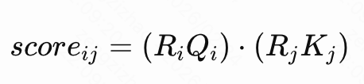

Ri = 第 i 个位置的旋转矩阵，Rj = 第 j 个位置的旋转矩阵

最终计算化简后注意力分数只有 j-i 有关

# Normalization

## 为什么需要归一化

**内部协变量偏移：**在训练深度神经网络时，网络中每一层的参数在每次迭代中都会更新。这意味着网络中的深层，由于它前面所有层的参数都在变化，因此这一层在每次训练中接收到的输入数据的分布也在不断地变化

归一化将数据的数值范围缩放到稳定的正态分布上加速模型收敛（减弱内部协变量偏移的影响，使得每层的输入分布、大部分数据集中在一个可接受的范围内，每层的参数拟合这个分布）、保证训练的稳定性（避免由于梯度消失、梯度爆炸导致训练挂了）、让模型训练不在依赖于权重的初始化。不同的归一化方法在于计算均值、方差的维度范围不同。

归一化步骤：

1.计算数据的均值、方差，对每个x使用如下公式标准化

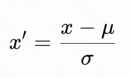

2.标准化的x的均值=0，方差=1，被强行固定导致失去了表达不同分布的能力，使用如下公式再次缩放、平移（其中缩放系数γ、平移系数β都是可学习的参数），使固定的标准正态分布变为模型需要的任意分布

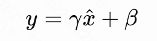

归一化后反向传播的梯度就是γ，只要γ不极端就不会出现梯度消失、梯度爆炸的问题

## Batch Normalization

每个通道下整个batch一起算均值和方差进行归一化

下面示意图中的C方向上的一个切面为一个样本，C为通道（样本的特征），N为batch

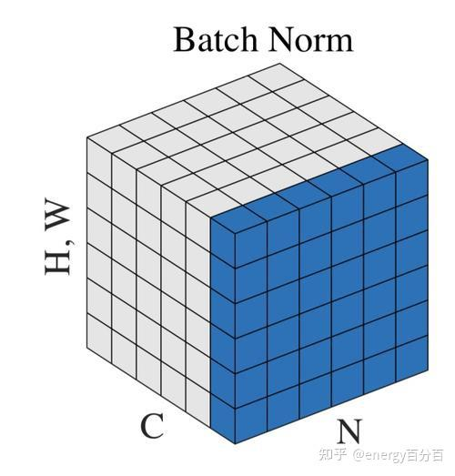

## Layer Normalization

每个样本的所有通道一起计算

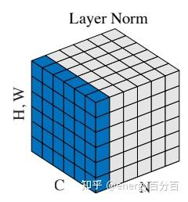

## Instance Normalization

每个样本的每个通道单独计算

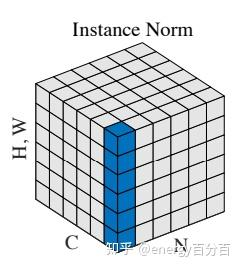

## Group Normalization

在一个样本内对通道分组，每组单独计算

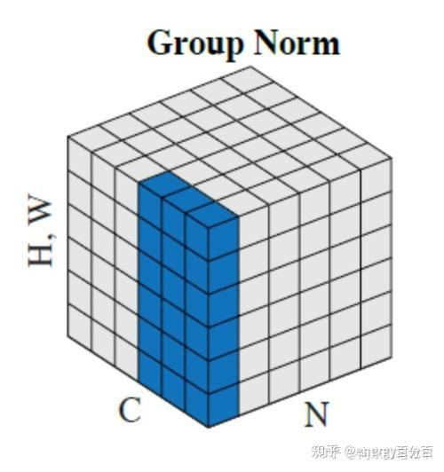

## RMSNorm

将基础归一化计算公式变为：只除以平方根，不减均值

## pre-norm与post-norm

pre-norm：将normalization操作放在残差连接之前

post-norm：将normalization操作放在残差连接之后

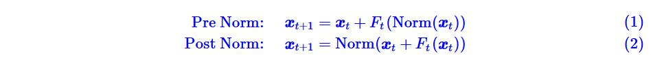

Pre-Norm结构往往更容易训练，但最终效果通常不如Post-Norm

# Decoding解码技术

transformer的解码阶段，经过一系列自注意力机制操作后，通过线性层将一个token的d维向量映射为词库维的向量，然后经过softmax输出对这个token的预测向量，其中根据预测向量选择输出token的过程就是Decoding，有如下几种解码策略

**贪婪搜索Greedy Search：**每次都选择概率最大的单词，存在问题为：一旦有一个错误，就会影响后续的预测；生成的文本单调，容易陷入局部最优

**束搜索Beam Search：**每个时间步保留概率最大的num_beams条路径，下一时刻有多个基础路径同时搜索，最终选择路径概率最大的那条最为最终输出。

例子：

num_beams为2时，开始strat标记产生了The(0.7)、A(0.2)、An(0.1)的单词分布，t1时刻记录了strat-The和start-A两条路径；

The产生了dog(0.7)、nice(0.2)、apple(0.1)

联合分布为The dog=0.7*0.7=0.49，

The nice=0.7*0.2=0.14 

The apple=0.7*0.1=0.07 

A产生了people(0.9)、man(0.1)

联合分布为A people=0.2*0.9=0.18 

A man=0.2*0.1=0.02 

t2时刻记录概率最大的两条路径：The dog和A people

dog、people继续产生后续单词分布，同时一直只保留两天路径，直接结束时选择概率最大的路径最为最终输出

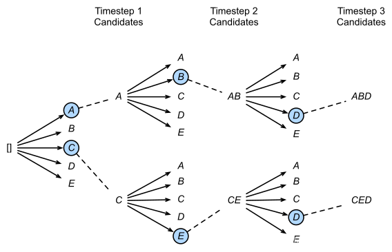

**Top K采样：**每次从概率最大的k个单词中随机选择一个。

**Top p采样：**又称核采样。从最小单词集合中随机采样，这个最小单词集合满足集合内单词概率和大于阈值p，且单词数是所有可能的集合中最小的。

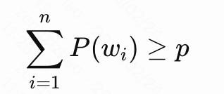取最小的n

> 输出单词的概率分布做缩放方法Temperature：调整单词的概率分布，温度高时各个单词概率分布差距小，温度低时各个单词概率分布差距大。实质是在Softmax将e的x次方变为e的x/temperature次方
>
> 

**联合采样：top-k——>top-p——>temperature**

例子：

首先 top-k = 3，保留概率最高的3个单词。这样保留女孩、鞋子、大象

- 女孩：0.664
- 鞋子：0.199
- 大象：0.105

接下来，使用 top-p，保留概率的累计和达到 0.8 的单词，即选取女孩和鞋子这两个单词

- 女孩：0.664
- 鞋子：0.199

接着使用 Temperature = 0.7 进行归一化，变成：

- 女孩：0.660
- 鞋子：0.340

接着，从上述分布中进行随机采样，选取一个单词作为最终的生成结果。

# Transformer

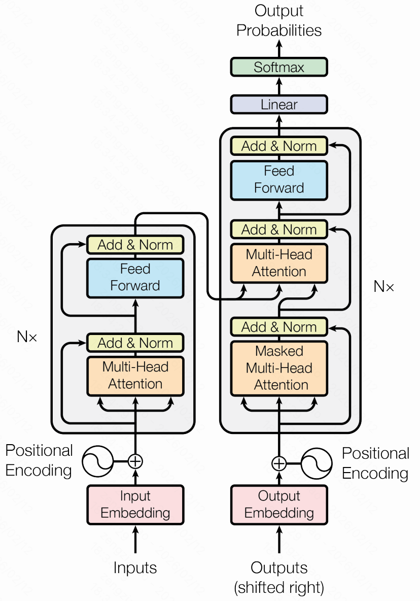

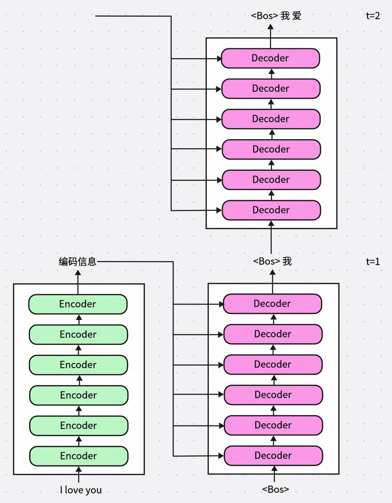

## 工作原理

**输入：**文本序列

**通过Input Embedding：**一个文本被tokenizer分为多个token，每个token向量化为嵌入向量（不同句子中的同一个token向量化得到的嵌入向量都是同一个泛型向量 ，没有参考上下文，只包含这个词本身的含义）

**通过位置编码Positional Encoding：**在嵌入向量中加入位置信息

**通过多头注意力：**每个嵌入向量获取到上下文的信息，移动位置变为包含了上下文语境的嵌入向量

具体如下：


Attention例子：

一个名词问"我前面有形容词吗？"，这形成一个查询；前面的形容词回答"有的，我在这。"，这形成一个回答键

使用查询矩阵Wq（模型参数）与所有token的嵌入向量相乘得到每个token的查询向量Q 

使用键矩阵Wk（模型参数）与所有token的嵌入向量相乘得到每个token的回答键向量K

计算所有token的查询向量与所有token的回答键的点积（点积后在除以查询-回答键空间维度的平方根），值越大说明查询与回答键的越相关，是一个相关性权重

掩码：因为transformer是预测当前词后面一个词的，要避免后面的词影响前面的词看到答案，所有将当前矩阵左下角（后面token的回答键与前面token的查询的点积）置为负无穷，softmax后就变为0

逐列将值进行Softmax进行归一化（一列中所有值之和为1，每个值介于0-1之间）

使用值矩阵Wv（模型参数）与所有的token的嵌入向量相乘得到每个token的值向量V，这个向量就是给后面token所加的向量（如果这个token需要调整目标token的含义，那么得对目标token的嵌入向量加上这个向量）

将键向量每一列求和得到键向量的改变量，原来的键向量加上改变量后得到更新的键向量，预期是一个更加精确的向量，编码了更丰富的上下文信息

多头注意力：并行执行上述单头注意力，每个头都有不同的回答键矩阵、查询矩阵、值矩阵。使得模型能学习到根据上下文改变语义的多种方式

经过多头注意力（Multi-Head Attention）每个头输出一个改变量

经过残差连接&层归一化（Add&Norm），将多头注意力每个头输出的改变量与原token的嵌入向量相加得到这个token最终的向量

经过前馈神经网络（Feedforward Neural Network，FNN，也叫多层感知机MultiLayer Perceptron，简称MLP）

多个编码器，一直重复上述注意力机制、前馈神经网络，为了让学习到上下文的token继续从有上下文的上下文中学习，从而提炼出精确的概念


每生成一个最终token就要将解码器完整跑一遍，可以看出解码器输出token的工作量远大于编码器


左侧灰色文本框内是一个编码器（将文本编码为高层次数字矩阵表示），一共有n个，前一个编码器的输出作为后一个编码器的输入。整体表现为输入一段文本（我是曾），经过计算后最终得到一个数字含义矩阵（这个矩阵可以理解为我是曾的一个高层概括）。

右侧灰色文本框内是一个解码器，一共有n个，接收编码器输出的含义矩阵、上一个解码器的输出。整体表现为输入编码器输出的含义矩阵、开始标记，经过计算后将得到的结果在传入到Linear、Softmax中，最终生成第一个token的分布概率（模型认识的每个token都有一个概率），选择概率最高的token作为第一个输出。之后将含义矩阵、开始标记+第一个token输入再走一次解码器，得到第二个token。一直循环往复，知道输出结束标记时停止，得到最终生成的token序列

每生成一个最终token就要将解码器完整跑一遍，可以看出解码器输出token的工作量远大于编码器

Linear层将解码器最后输出矩阵的最后一个向量（列）映射为一个基于当前tokenizer词汇表所有词对应分数的向量。这个向量经过Softmax归一化后变为概率分布，我们每次选择概率最高的token作为输出，所以对于相同的含义矩阵（输入文本）生成的token序列都是相同的。我们可以设置一些参数让模型更有创造性：比如temperature温度，实质是在Softmax将e的x次方变为e的x/temperature词法，当t增加时使得小概率的token概率占比；Top-K，从前K个token中选择

transformer模型训练是监督学习SFT，需要成对的翻译前后的文本

编码器主要负责理解文字，Google将解码器删除，剩下encode部分，形成encoder-only transformer，这就是Bert的模型架构，适合提取文字中的信息

解码器主要负责生成文字，OpenAI将解码器中和含义矩阵相关的部分全部删除，剩下decoder部分，形成decoder-only transformer，这就是GPT2的模型结构，适合做文字接龙，训练时只需要提供输入即可，进行自监督学习


通过Input Embedding一个句子被tokenizer分为多个token，每个token向量化变为一个嵌入向量（不同句子中的同一个token向量化得到的嵌入向量都是同一个泛型向量 ，没有参考上下文，只包含这个词本身的含义）

通过位置编码（Positional Encoding），在向量中加入位置信息

通过Attention获取到了周围的信息后，各个泛型向量移动位置变为包含了上下文语境的向量

Attention例子：

一个名词问"我前面有形容词吗？"，这形成一个查询；前面的形容词回答"有的，我在这。"，这形成一个回答键

使用查询矩阵Wq（模型参数）与所有token的嵌入向量相乘得到每个token的查询向量Q 

使用键矩阵Wk（模型参数）与所有token的嵌入向量相乘得到每个token的回答键向量K

计算所有token的查询向量与所有token的回答键的点积（点积后在除以查询-回答键空间维度的平方根），值越大说明查询与回答键的越相关，是一个相关性权重

掩码：因为transformer是预测当前词后面一个词的，要避免后面的词影响前面的词看到答案，所有将当前矩阵左下角（后面token的回答键与前面token的查询的点积）置为负无穷，softmax后就变为0

逐列将值进行Softmax进行归一化（一列中所有值之和为1，每个值介于0-1之间）

使用值矩阵Wv（模型参数）与所有的token的嵌入向量相乘得到每个token的值向量V，这个向量就是给后面token所加的向量（如果这个token需要调整目标token的含义，那么得对目标token的嵌入向量加上这个向量）

将键向量每一列求和得到键向量的改变量，原来的键向量加上改变量后得到更新的键向量，预期是一个更加精确的向量，编码了更丰富的上下文信息

多头注意力：并行执行上述单头注意力，每个头都有不同的回答键矩阵、查询矩阵、值矩阵。使得模型能学习到根据上下文改变语义的多种方式

经过多头注意力（Multi-Head Attention）每个头输出一个改变量

经过残差连接&层归一化（Add&Norm），将多头注意力每个头输出的改变量与原token的嵌入向量相加得到这个token最终的向量

经过前馈神经网络（Feedforward Neural Network，FNN，也叫多层感知机MultiLayer Perceptron，简称MLP）

多个编码器，一直重复上述注意力机制、前馈神经网络，为了让学习到上下文的token继续从有上下文的上下文中学习，从而提炼出精确的概念


掩码矩阵在自注意力中的softmax之前使用

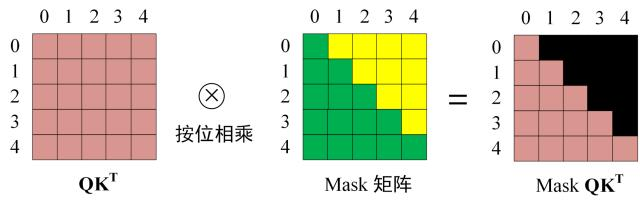


## 应用

**Encoder-only模型：**只使用Transformer中的Encoder模块，适用于只需要理解输入语义的任务，例如句子分类、命名实体识别。代表模型有BERT、ViT

**Decoder-only模型：**只使用Transformer中的Decoder模块，适用于文本生成的任务。代表模型有GPT

**Encoder-Decoder模型：**又称Seq2Seq模型


# 推理引擎

类比web应用，写好的代码不能直接运行，需要借助nginx部署到web服务器上。而训练得到的模型文件类比写好的代码，需要借助推理引擎运行。


# 强化学习

强化学习Reinforcement learing，简称RL

DQN（Deep Q-Networks）

TRPO（Trust Region Policy Optmization）

近端策略优化PPO（Proximal Policy Optimization）


# 智能体与工作流

智能体：大模型根据任务需求自主规划执行流程、工具调用，独立完成一项任务的系统

工作流：通过预定的流程来协调大模型与工具的系统，大模型只是工作流中的一个组件，只能按照预设的流程走


# claude code

```bash
# 查看可用的子agent
/agents

# 终端对话引用图像
# 1.拖拽图片到cli；2.复制图片后粘贴到cli；3.在cli中提供图片路径

# 引用文件、目录、子agents
# 通过@符引用

```

## 子agent

### 内置子agent

Explore：使用便宜的Haiku模型快速、只读地搜索分析代码库

Plan：继承主对话的模型，只读模式对代码进行规划

General-purpose：继承主对话的模型，可读可写处理任务

Bah：继承主对话的模型，当在单独的上下文中运行终端命令时调用

statusline-setup：使用Sonnet模型，当运行 `/statusline` 来配置状态行时调用

Claude Code Guide：使用Haiku模型，当提出关于Claude Code功能的问题时调用

### 创建自定义子agent

通过/agents命名创建，或者书写带有YAML前置元数据的MD文件

全局个人agents：所有项目都可以使用的agents，存放在`~/.claude/agents/`下

项目agents：仅当前项目可以使用的agents，存放在每个项目的`.claude/agents`下


# Prompt

**System prompt：**描述当前AI的角色、性格、背景信息等定位（非用户想直接发生的消息）

**User prompt：**用户想直接询问的问题，发送给AI的话


# Function Call

Function Call 是一种实现 LLM 连接外部工具的机制。调用 LLM 时，调用方描述函数（包括函数的功能描述、请求参数说明、响应参数说明），LLM 根据用户的输入，选择调用某个函数，并将用户的自然语言转换为调用函数的请求参数，函数名与参数通过 JSON 格式返回给调用方。调用方使用 LLM 返回的函数名称和参数，调用函数并得到响应，之后将响应传给 LLM，从而获得自然语言的回答

**大模型的function call能力是如何获得的？**

对基础模型进行sft获得，教会LLM两件事：识别意图（理解用户的请求是否需要借助外部工具/函数来完成，而不是直接生成文本回答）、参数提取与格式化（如果需要调用函数，要正确地从用户请求中抽取出所需的参数，并按照预先定义的格式（通常是json）生成函数调用的指令）

sft的过程如下：

- 步骤 1：数据集构建：构建包含 Function Calling 场景的指令微调数据集，每条数据样本包含用户输入（可能需调用函数或直接回答的请求）、可用函数 / 工具描述（函数用途、参数类型等结构化文本）、期望输出（需调用函数时为含函数名与参数的 Json，否则为文本回答）。
- 步骤 2：选择基础模型：选用具有指令遵循能力的预训练大模型（如 Llama、GPT、Qwen 等）。
- 步骤 3：格式化训练数据：将 “用户输入” 与 “可用函数描述” 拼接为模型输入（Prompt），“期望输出”（Json 函数调用或文本回答）作为目标输出（Completion/Target）。
- 步骤 4：进行微调：使用标准 SFT 方法（全参数微调或 PEFT 如 LoRA）在数据集上训练，优化目标为最小化预测输出与期望输出的差异（如交叉熵损失），使模型学会根据输入与函数描述，决定直接回答或生成特定格式的函数调用 Json。


# MCP

**MCP定义了一套标准化的工具发现、调用和管理机制， 它规定了应用程序之间如何通信**

## 通信方式

stdio（**st**an**d**ard **i**nput and **o**utput 标准输入输出）：推荐，高效、简洁、本地


http：可远程

## 通信格式

基于JSON-RPC的进一步规范

JSON-RPC：一种远程过程调用（RPC，Remote Procedure Call）协议，使用Json作为数据格式，通过网络调用远程服务器上的方法

## MCP与function call的区别

MCP支持动态工具发现，模型可以在运行时发现新的可用工具，无需重新训练或部署。function calling需要将工具函数直接集成到模型代码中，工具更新需要重新部署整个系统

MCP提供了标准化的工具接口定义，包括工具名称、描述、参数格式、返回值等，确保工具调用的规范性。function calling缺乏标准化的工具管理机制，不同工具的参数格式、返回值格式可能不一致

MCP支持跨应用的工具共享，一个MCP服务器可以被多个客户端使用。function calling只能在单个应用中使用


# RAG

## 索引Index

步骤：

将知识内容分割Split

嵌入Embedding：使用嵌入模型将文本内容转换为一个嵌入向量，核心逻辑就是将文本token化，对每个token计算其嵌入向量，将文本对应的所有嵌入向量池化得到一个平均嵌入向量

存储Storage：存储嵌入结果到向量数据库

## 检索Retrieval

将用户的问题与建立的索引进行匹配，得到相关度高的结果

## 生成Generation

将匹配到的知识与用户问题混合给LLM，得到最终结果


# Rules


# Skills

**skill的组成：**一个skill技能对应一个文件夹，一个技能通常包含skill.md文件、相应的文档、可运行脚本

**skill.md的组成：**skill.md文件为该技能的说明，由yaml头（技能名称、技能间接描述）、md格式的详细技能使用描述（在描述中又可以引用当前skill下其他文档、可运行脚本或者其他skill）组成。

**解决了token有限问题：**yaml头文件少，总是会被加载到上下文中；md格式的技能描述在AI认为需要使用该skill时触发加载，文件体积大小适中；AI使用该skill时按需使用描述中引用的当前skill下其他文档、可运行脚本或者其他skill。这样解决了上下文token受限的问题，避免了一个工具放在上下文中就占用大量token

## 与MCP的区别

skills是AI的行为规范层，负责帮AI固定化专业流程完成任务（期间可以通过MCP连接外部系统来完成工作）；MCP是Agent与外部系统的标准化交互接口，负责AI连接外部世界（Agent连接数据库、github等）

skills就是简单的md文件；MCP创建需要编程、服务器配置

skills是渐进式加载按需加载工具；MCP在启用时就需要加载该MCP下所有工具

