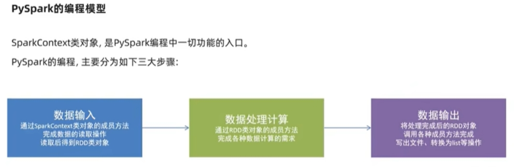
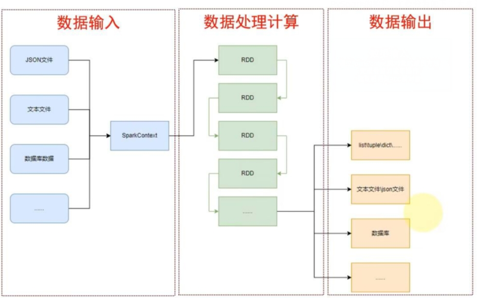

PyPI：Python Package Index，Python包索引

# Spark

Spark是Apache下用于大规模数据处理的一款分布式计算框架，用于调度成百上千的服务器集群，计算TB，PB乃至EB级别的海量数据

可以在作为python库，在自己的计算机上，用里库方法进行数据处理；提交至Spark集群，提交到成百上千的服务器集群进行分布式集群计算

RDD：弹性分布式数据集

PySpark对数据的处理都是以RDD对象为载体的，数据存储在RDD内，其成员方法就是RDD的各类数据计算方法，其返回值依旧是RDD对象

