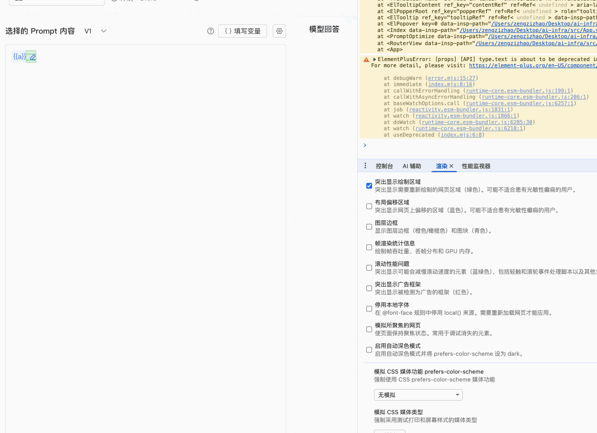

# window上的api

**window.history**

浏览器路由会话历史控制器

**window.location**

当前页面url控制器，通过其属性读取url


# ES6

**可选链操作符`obj?.a?.b`：**安全地访问嵌套对象的属性，避免因为中间属性为 `null`或 `undefined`而抛出错误。使用了可选链操作符后一旦遇到 `null`或 `undefined`，立即返回 `undefined`

**空值合并运算符??`a??b`：**当运算符前的运算子a是`null`或`undefined`时，返回运算符后面的运算子b

**&&的短路：**从左到右依次判断每个操作数，若某个操作数为假值，立即返回该假值（短路），若所有操作数都为真值，返回最后一个操作数

**||的短路：**从左到右依次判断每个操作数，若某个操作数为真值，立即返回该真值（短路），若所有操作数都为假值，返回最后一个操作数


# CSS中的坑

## css属性计算过程

参考样式表中没有冲突的属性声明作为css属性值

对于样式表中有冲突的属性按照层叠规则确定css属性值

对于仍然没有值的属性，采用继承的方式继承父元素的值

对于仍然没有值的属性，使用默认值


## height

不设置height时默认为auto，由内容撑开

设置为百分比时，如果父元素设置了固定高度则表示为父元素高度的百分之xx，如果父元素没有设置固定高度则任然为auto由内容撑开


## background属性

background是多个控制背景样式属性的综合简写

```
background:background-color background-image background-position / background-size background-repeat background-attachment background-origin background-clip
```

**background-color**

只能设置纯色

**background-image**

可以设置渐变色，也可以通过url设置图片

**background-position**

定义背景图像的起始位置

```
background-position:x-axis y-axis;
取值：
关键词：left|center|right,top|center|bottom(水平,垂直)
具体值：apx,bpx(距离容器左侧apx,距离容器顶部bpx)
百分比值：a% b%(将图片上水平方向x%,垂直方向y%的点与容器水平方向x%,垂直方向y%的点对齐)
```


**background-size**

控制背景图像的尺寸

```
background-size:width height;
取值：

关键词：
contain：等比缩放图像，确保图像的整个宽度和高度都能完全显示在容器内
cover：等比缩放图像，确保图像能完全覆盖整个容器区域。
auto：默认值。图像保持原始尺寸。

具体值：100px,200px
百分比：x%,y%(图片宽为容器宽的x%,高为容器高的y%)
```


**background-attachment**

定义背景相对于视口如何滚动, fixed背景固定于视口,local随元素内容滚动

**background-clip**

背景的绘制区域，取值为border-box、padding-box、content-box

```
设置为text时表示背景只绘制在容器的文字中，需要搭配-webkit-background-clip同时设置
background-clip: text;
-webkit-background-clip: text;
当再加上-webkit-text-fill-color/color: transparent;将容器内的文字颜色设置为透明，即可实现文字遮罩效果
```


## css函数

### attr函数：获取html元素属性值

```css
div::before{
  content:attr(div上的属性名)
}
attr(选择器选中元素上的属性名):一般结合伪元素用在content属性上，通常是获取自定义属性data-*配合使用
```


### var函数：使用css变量

声明css变量：

css变量必须以`--xxx`命令，写在`:root`伪元素中声明为全局变量，也可以写在其他选择器中声明为局部变量

```css
:root{
	--main-color:red;
}
```

通过var函数使用css变量：

```css
div{
  color:var(--main-color,black);
}
var(css变量名,备用值):取对应的css变量，如果不存在则使用备用值
```


## 新增选择器

```css
// css伪类:not,选中不匹配指定selector选择器的元素
:not(selector)

```


## 常用特效

#### 渐变色字体

利用元素的background背景实现渐变色字体

```css
// 将背景渐变色通过background-clip只应用在text文本中，同时将字体颜色设置为transparent。此外加上-webkit-前缀的属性保证兼容性
.div{
  background: linear-gradient(
          			103deg,
          			#9c57ff 4.3%,
          			#1c77ff 57.52%,
          			#2ad6ff 110.73%
        			);
  background-clip: text;
  color:transparent;
  -webkit-background-clip: text;
  -webkit-text-fill-color: transparent;
}
```

#### 渐变色边框

利用元素的background背景实现渐变色边框

```css
// 将纯色绘制延伸至padding-box,将渐变颜色绘制延伸至border-box中，同时设置border的颜色为透明色
.div{
  background: linear-gradient(white, white) padding-box,
          linear-gradient(45deg, #ff6b6b, #4ecdc4) border-box;
  border: 5px solid transparent;
}
```


## scss

### 基础语法

```scss
// 串联选择器：选中同时拥有类a和类b的元素
.a.b{}
// 后代选择器：选中拥有类a元素下拥有类b的元素
.a .b{}
```


# Typescript

## declare

declare通常用在类型声明文件（.d.ts）中

**声明模块**

用于扩展第三方模块

```ts
declare module '模块名'{
  interface A{
    x:x
  }
}
```


## 非空断言操作符!

告诉编译器，我确定这个值不是`null`或`undefined`，不要担心，直接执行即可

```ts
expression!
```


# Vue普通语法中的坑

## 响应式

DOM更新时机：当修改了响应式状态时，DOM 会自动更新。但是 DOM 更新不是同步的，Vue 会在" nextTick "更新周期中缓冲所有状态的修改，以确保不管进行了多少次状态修改，每个组件都只会被更新一次。

### Ref

`ref`响应式对象将值包裹在一个带有 `.value` 属性的特殊对象中

`ref`具有深层响应式，对象类型的值通过`reactive`转换为响应式

> `shallowRef` 放弃深层响应式，对于浅层 `ref` ，只有 `.value` 的访问会被追踪。浅层`ref`可以用于避免对大型数据的响应性开销来优化性能、或者有外部库管理其内部状态的情况。

### Reactive

`reactive()` 使对象本身具有响应性，不用将对象值包裹到一个特殊对象中

`reactive()` 具有深层响应式，对象类型的值通过`reactive`转换为响应式

> `shallowReactive()`：浅层`reactive` 

### ref与reactive的区别

ref可用于任何类型（基本类型、对象类型）；reactive只能用于对象类型

两者解构会丢失响应式，必须使用toRefs


## 计算属性

### computed

接收一个getter函数，返回一个只读的响应式ref对象

接收一个带有 `get` 和 `set` 函数的对象来创建一个可写的 ref 对象。


## 侦听器

### watch

侦听数据源：一个响应式对象（`ref/reactive/computed/readonly/shallowRef/...`）、一个`getter`函数、以上两个来源组成的一个数组。

默认是懒执行的，不会在一开始创建侦听器时就执行一遍回调

#### 传响应式对象

**ref对象**

正确写法：

```vue
const msg=ref({})
watch(msg,cb)
```

传`ref`对象本身，会自动侦听`ref`对象的`.value`（即会自动追踪`msg.value`），无需`.value`；且只能监听到`refObj.value`对象的整体替换，其嵌套属性的变化需要开启深层监听

错误写法：

```vue
const msg=ref({})
watch(msg.value,cb)
```

`msg.value`是一个普通对象，不是一个响应式对象

**reactive对象**

传reactive对象，会隐式地创建一个深层侦听器

#### 传getter函数

对比前后`getter`函数返回是否相同，从而执行回调

正确写法：

```vue
const msg=ref({})
watch(()=>msg.value,cb)
```

返回`refObj.value`的`getter`，在`refObj.value`改变时触发

错误写法：

```vue
const msg=ref({})
watch(()=>msg,cb)
```

返回`refObj`的`getter`，没有读取 `.value`，因此不会因 `refObj.value` 变化而触发；只有在`refObj`整体替换时才触发。

> 但是写为如下
>
> ```vue
> const msg=ref({})
> watch(()=>msg,cb,{deep:true})
> ```
>
> 又可以监听到msg.value的变化了


### watchEffect

自动追踪回调中同步代码中的响应式依赖（`await`异步代码后的响应式依赖不会收集），当依赖变化时重新执行回调。

不是懒执行的，在初始创建时会立即执行一次回调。

对于嵌套属性，只跟踪回调中被使用到的属性，而不是递归地跟踪所有的属性。


### watch与watchEffect区别

watch需要指定侦听的数据源；而watchEffect自动收集依赖

watch默认懒执行，初始时不会立即执行一次；watchEffect初始时立即执行一次

watch可以拿到旧值；watchEffect拿不到旧值

watch可以侦听异步中的响应式数据；watchEffect不能侦听异步中的响应式数据，只能侦听同步中的响应式数据


### 副作用清理

`onWatchCleanUp`与`onCleanup`在副作用下一次重新执行前调用（当前侦听器即将重新运行时执行），可以用来清除无效的副作用，例如等待中的异步请求。

#### onWatcherCleanup

`Vue3.5+`支持，在 `watchEffect` 效果函数或 `watch` 回调函数的同步执行期间调用，不能在`await` 异步代码后调用。

#### onCleanup

作为 `watchEffect` 效果函数的第一个参数或 `watch` 回调函数的第三个参数。通过函数参数传递的`onCleanup`与侦听器实例相绑定，所以不受同步限制


### 回调触发时机

侦听器回调函数会被批量处理以避免重复调用。

默认情况下`flush:'pre'`，侦听器回调会在侦听器所在组件的父组件更新 (如有) **之后**、侦听器所属组件的 DOM 更新**之前**被调用。这表明在侦听器回调中访问侦听器所属组件的 DOM，那么 DOM 处于更新前的状态。

如果想在侦听器回调中访问被 Vue 更新**之后**的侦听器所属组件的 DOM，配置 `flush: 'post'` 

如果想在 Vue 进行任何更新之前触发侦听器回调，配置`flush:'sync'`同步触发的侦听器（比`pre`触发时机更早）

```
三种模式的顺序：
sync:  count++ → watch(sync) → ... → DOM 更新（稍后）
pre:   count++ → queue job → watch(pre) → DOM 更新
post:  count++ → queue job → DOM 更新 → watch(post)
```


### 侦听器的停止

侦听器创建时会返回一个停止该侦听器的停止函数。

在 `setup()` 中用同步语句创建的侦听器，会自动绑定到宿主组件实例上，并且会在宿主组件卸载时自动停止。如果用异步回调创建一个

侦听器，它不会绑定到当前组件上，必须手动停止它，以防内存泄漏。


# Vue高级API

## defineProps

[props](https://cn.vuejs.org/api/options-state#props)

**普通js的defineProps（运行时声明）**

```ts
// 使用字符串数组的方式定义
defineProps(['name','age'])

// 使用对象的形式
defineProps({
	name:{
		type:String,
		default:'张三'
	}
})
```

**TS+defineProps（类型声明）**

使用类型声明静态分析会自动生成等效的运行时声明[官网](https://cn.vuejs.org/api/sfc-script-setup#type-only-props-emit-declarations)

```ts
// 利用泛型传递纯类型参数的方式定义
// 泛型直接传入字面量
defineProps<{
    name:string
}>()
// 泛型传入接口
interface Props{
    name:string
}
defineProps<Props>()
```

使用类型声明时指定默认props：withDefaults()

```ts
interface Props{
    name:string
}
const props=withDefaults(defineProps<Props>(),{
    name:'张三'
})
```


## defineEmits

**普通js的defineEmits（运行时声明）**

```vue
const emits=defineEmits(['change','delete'])
```

**TS+defineEmits（类型声明）**

```vue
const emits=defineEmits<{
	(e:'change',value:string):void
    (e:'update'):void
    // 事件名  需要传递的值（可无）
}>()
```

更简洁的语法糖

```vue
const emits=defineEmits<{
    'close':[],
    'success':[id:number,val:string]         
}>()
```


## effectScope

批量管理副作用，在适当的时机统一清理


## defineModel

以前在自定义组件上使用v-model需要在子组件内通过defineProps定义属性、defineEmits定义事件，并在相应的时候触发事件将最新值抛给上层。而有了defineModel后简化了子组件该过程，在子组件内部直接使用defineModel即可声明一个双向绑定 prop，它在底层声明了一个prop和一个相应的值更新事件，无需再使用defineProps、defineEmits。

```ts
// 声明了一个content的prop，父组件通过v-model:content使用
const content=defineModel('content',{type:String,defalt:''})
// 修改该值时，自动触发update:content事件抛给上层
content.value='1111'
```


## defineOptions

用于在script的setup中设置原来只能写在export default{}里的组件选项

inheritAttrs配置：默认为true，vue会自动把组件上接受到的非props的所有attribute自动绑定到组件模板的根节点上


# Vue-Router高级API

## useRouteQuery

获取和设置路由查询参数的工具函数

```ts
const key=useRouteQuery('key','')
// 获取路由查询参数中键名为key的值，如果没有该键值，则使用后面的默认值
// 返回的key变量是响应式数据，会响应式更新
```


# Vue的样式作用域控制

## scoped

给组件style标签加上scoped后，vue会给当前组件每个元素加上一个唯一的数据属性data-v-xxx实现样式隔离，我们在style中写的常规的不加深度选择器的样式最终转换如下，使得父组件中写的样式无法直接选中子组件内部的元素

> 子组件最外层容器同时拥有父组件的数据属性、子组件自身的数据属性，所以父组件可以选中子组件最外层容器

```css
.test{
  color:red
}
--->转换后:同时拥有.test类且存在属性data-v-c815ea7e的元素
.test[data-v-c815ea7e]{
  color:red;
}
```

## :deep()深度选择器

使用了深度选择器的样式最终转换如下，原理是重组CSS选择器，将唯一数据属性前移到目标选择器前，从而可以选中对应元素

```css
:deep(.test){
  color:red
}
--->转换后:属性data-v-c815ea7e的元素的后代中有.test类的元素
[data-v-c815ea7e] .test{
  color:red;
}
```

常用于修改第三方组件样式

## :global()全局选择器

定义全局样式，不加上当前组件的作用域数据属性，对整个应用中所有匹配到的元素都生效

```css
:global(.test){
  color:red
}
--->转换后
.test{
  color:red
}
```

常用于修改一些被渲染到 `<body>`根节点下的组件（如使用 `Teleport`的弹窗、消息提示等），由于其不在当前组件树内，使用 `:deep()`可能无效，此时需要使用 `:global`


# VueUse

## 最佳实践

返回一个对象，使用者通过对象解构提取所需内容

副作用清理：自动清理副作用，如果需要手动释放副作用则返回一个停止函数stop


# Vue指令

## v-for

**遍历数组**

```vue
const arr=[1,2,3]
<div v-for="(value,index) in arr">
  {{value}}--{{index}}
</div>
// vlaue为数组元素值，index为数组元素在数组中的索引
```

**遍历对象**

```vue
const obj={
	name:'zzz',
	age:20
}
<div v-for="(value,key,index) in arr">
  {{value}}--{{key}}--{{index}}
</div>
// vlaue为属性值，key为属性名，index为该属性在对象中的索引
```


# 浏览器开发者工具

## 按键

打开命令菜单：`shift command P`


## 面板标签页

### 渲染

打开命令菜单运行渲染 或者 打开控制台抽屉栏打开渲染，即可打开如下的渲染标签页


其中第一项突出显示绘制区域会以绿色形式查看当前重绘的网页区域，例如如下




# 项目打包器

baidi->rspack


# git

## ssh、https与git config的name与email区别

ssh和https是两种连接和认证到远程仓库的方法

设置git config的user.name与user.email用来标记每次代码提交commit

## 命令

git pull：在A分支上执行git pull会1.更新当前分支为远程最新代码；2.获取所有分支的最新信息（但不会将其他分支更新到最新代码，其他分支要更新必须切换到对应分支后再pull更新）

查看本地分支：git branch

查看所有分支（本地+远程）: git branch -a

查看本地与远程分支跟踪情况：git branch -vv

基于当前所在分支创建新分支：git branch 新分支

切换到某分支：git checkout 分支名

基于当前所在分支创建新分支并切换到该新分支：git checkout -b 新分支

基于源分支创建新分支：git checkout -b 新分支 源分支

将某个\某几个提交从一个分支应用到另一个分支：

```bash
# 切换到要应用的分支
git checkout main
# 将A分支的e3f2a5f提交应用到main分支
git cherry-pick e3f2a5f
```


## 常规流程

拿到一个项目仓库时的基本步骤：

git clone将仓库克隆到本地

如果远程仓库中已经创建好分支，规定了你在dev分支上开发，则git checkout dev切换分支，之后npm i安装依赖进行开发；

如果远程仓库没有创建分支，需要你自己创建一个分支开发，则git checkout -b dev创建dev分支并切换到dev分支开发，之后npm i安装依赖进行开发（由于远程仓库没有该分支，之后git push -u origin 分支名，首次推送后远程仓库会自动创建新分支）

> 基于dev分支创建feature/a分支：
>
> 方法1：先git checkout dev切换到dev分支，之后git checkout -b feature/a创建并切换到feature/a分支
>
> 方法2：先git branch feature/a dev基于dev创建feature/a分支，再git checkout feature/a切换到feature/a分支
>

本地开发完时要提交代码到远程仓库，有如下两种方式

1. 先git stash将本地修改放到暂存区，然后git pull拉取远程更新，之后git stash pop将本地修改从暂存区取出（此时可能会要解决远程更新与本地修改的冲突），冲突解决完毕后git add .、git commit -m 'xxx'、git push（首次push时需要git push -u origin dev设置上游分支，跟踪远程分支）
2. 先git add .和git commit -m 'xxx'提交本地修改，之后git pull --rebase拉取远程更新同步并合并本地修改（此时可能会要解决远程更新与本地修改的冲突），冲突解决完毕后git add 冲突文件、git rebase --continue、git push（首次push时需要git push -u origin dev设置上游分支，跟踪远程分支）


**提交信息书写规范**

提交的类型：提交的内容

feat：新功能

fix：修补bug

docs：文档

style：格式（不影响代码运行的变动）

refactor：重构（不是新增功能也不是修改bug的代码变动）

test：增加测试

chore：构建过程或辅助工具的变动


**情形1：本地已经commit了，但是此时远程仓库有更新，我们commit前未及时pull远程的更新**

此时我们直接push会失败

方法一，直接git pull会将远程更改合并到本地分支，之后git会创建一个新的合并提交（需要你自己命名），如下图


方法二，使用git pull --base，实现线性的项目历史，这样就不会产生上面的分支以及合并提交Merge，而是直线历史

rebase会先取出你本地的修改，暂时移除它们，之后将远程分支的新修改作为新基线，之后将本地修改重新应用到新基线

> 若已经先普通pull了形成了分支历史，此时想改用rebase形成线性历史，则git reset --hard ORIG_HEAD回退到合并前状态，之后执行git pull -rebase，最后再git push推送

**引发冲突的情况**

- 同一文件的同一区域被修改

  > 例如，A修改了index.html的第10-20行，B修改了index.html的第15行

- 一个修改了文件，另一个删除了文件

  > A修改了style.css，B删除了style.css

**不会引发冲突的情况**

- 修改不同文件，自动合并
- 修改同一文件不同区域，自动合并
- A修改文件，B未改动，自动应用A的修改
- A删除文件，B未改动，自动删除
- A重命名文件，B未改动，自动重命名


## Merge Request(MR)

MR/PR：将其他开发分支合并入主分支master。

**发起MR前当前分支的最佳实践：**当前分支A基于main分支建立后开发了一段时间后开发完想要往main分支上合时，此时可能其他人在我们新建A分支时建立了其他特性分支开发并已经往main上合并了，A分支上有许多当前main上没有代码，此时我们直接创建MR，github/gitlab平台会自动尝试进行一次模拟合并，会出现以下两种情况：

1. 如果当前分支A与main分支没有冲突，则MR界面会显示一个”可以自动合并“的按钮，审核者点击合并后git会自动将代码合并

2. 如果当前分支A与main分支有冲突，则MR界面会显示无法自动合并，需要解决冲突后才会变成”可以自动合并“的按钮。这时可以是审核员自己在平台web界面上处理冲突后再合并；也可以审核员评论让开发者在本地处理冲突后在提交，审核完毕后再合并。

   > 开发者本地处理冲突：
   >
   > 切换到main分支后更新最新代码，切换回A分支，合并main
   >
   > ```bash
   > git merge main
   > ```
   >
   > 此时需要解决冲突，解决冲突后在commit即可
   >
   > ```bash
   > git add .
   > git commit -m 'Merge main into A and resolve conflicts'
   > ```

**发起MR后该分支后续的commit在合并成功前都能实时显示看到：**创建好从A分支到main分支的MR后，如果审核人评论让你修改，你在A分支上修改push后审核人能看到当前分支的最新修改代码，等到审核通过后就可以合并。


# ks环境

prod：业务线上环境，真正承载用户流量的环境

preonline：预上线环境

staging：测试环境

dev：本地开发环境


# ks的各个平台

天穹：前端代码审查

破晓：无头浏览器

KDev：对标gitlab的代码仓库

天琴：CICD流水线平台

天问：监控平台

Team：记录产品的需求单、测试的bug单的工单系统


# 泳道

通过泳道将各个开发分支的测试环境隔离开，互不干扰

**实现**

访问测试地址时在请求头中加上一个特定字段标识（通过Chrome浏览器插件ModHeader - Modify HTTP headers实现）为xx泳道，反向代理服务器nginx会根据该请求的请求头header中该字段表示打到不同的泳道环境里，从而实现了各自开发分支的测试互不影响

> ModHeader：一个用来修改 Http 请求 Header 内容的浏览器插件。
>
> 利用了浏览器扩展（Extensions) API 中的 [webRequest](https://link.juejin.cn?target=https%3A%2F%2Fdeveloper.mozilla.org%2Fen-US%2Fdocs%2FMozilla%2FAdd-ons%2FWebExtensions%2FAPI%2FwebRequest) 相关的 API 实现的。主要利用的是`onBeforeSendHeaders`和`onHeadersReceived`事件来分别修改请求头和响应头。利用 webRequest 相关的 API，还可以做一些取消、重定向请求的操作。


# CDN

访问资源域名时，域名解析会交给CDN做调度，CDN调度系统根据当前用户IP、各节点负载等决定把你分配给某个边缘节点（即将域名对应的最佳IP返回给用户），然后用户浏览器直接去访问对应的边缘节点

## CDN容灾

当某个 CDN 故障时，用户依然能成功加载 JS/CSS/图片，不让页面或业务瘫痪。


# 术语

回归测试：确保已有功能在进行修改或新增功能后依然正常工作的测试。当代码发生变更或修复 bug 后，回归测试可以确保这些变更没有引入新的错误或重新引入旧的错误。


