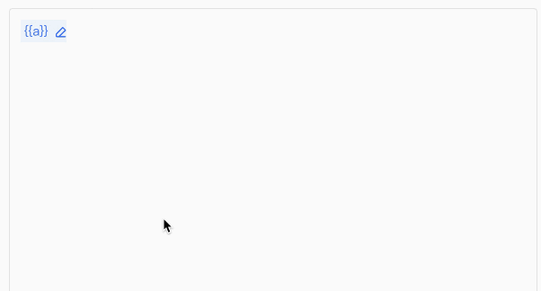
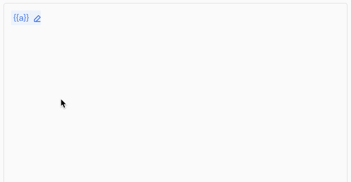

# prompt编辑器重绘制导致的闪烁问题——一次性能调优

## 问题

**源代码：**

之前笔编辑按钮通过`Tiptap的Decoration.widget`实现，由于未指定每个`Decoration.widget`的`key`，导致`ProseMirror` 认为这个组

件改变了，不会复用旧的DOM节点，而是建立新的DOM节点，从而引起了重绘制

**web上的体现：**



## 优化

**改进思路：**

给每个`Decoration.widget`指定一个的`key`（变量名_变量在整个文档的绝对位置-变量值组成），当变量名、变量在文档中的位置、变

量值变化时，底层会创建新DOM替换旧DOM；上述没有变化时不会建立新的DOM节点，复用旧的DOM节点，避免了重绘制

**web上的体现：**




# prompt编辑器二次优化重构思路

变量语法、变量编辑的笔的按钮使用Node实现，从而对于连续同名变量`{a}{a}`形成如下html结构

```html
<span class='variable-tag-node' data-variable='a'>{{a}}</span>
<span class='variable-btn-node'>
	<button>
  	<span class='varValue'>存放当前变量名对应的变量值</span>
    
  </button>
</span>
<span class='variable-tag-node'>{{a}}</span>
<span class='variable-btn-node'>
	<button>
  	<span class='varValue'>存放当前变量名对应的变量值</span>
    
  </button>
</span>
```

这样避免在不给每个变量标记加上唯一key（变量名+变量在整个文档中的起始位置）的情况下，连续变量粘连被底层合并为一个大标记的问题

工具调用使用Node实现，这样可以实现`atom`原子化，光标不会在工具节点内部移动，从而避免了光标键盘删除工具名的现象