# HMR

## 编译过程

将源代码中的路径进行处理，重写模块路径（第三方依赖路径替换为预构建缓存.vite中的路径，普通路径替换为根目录的绝对路径）

**源代码**

 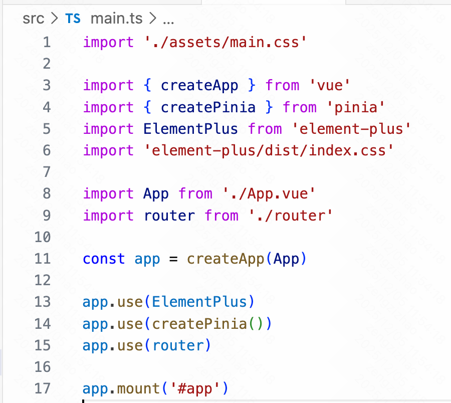

**编译后的代码**

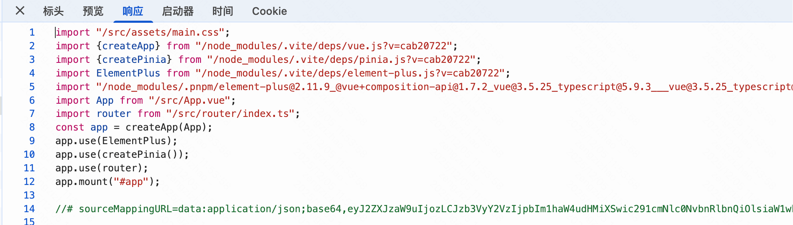

对于vue文件会将样式部分抽离，通过import方式引入

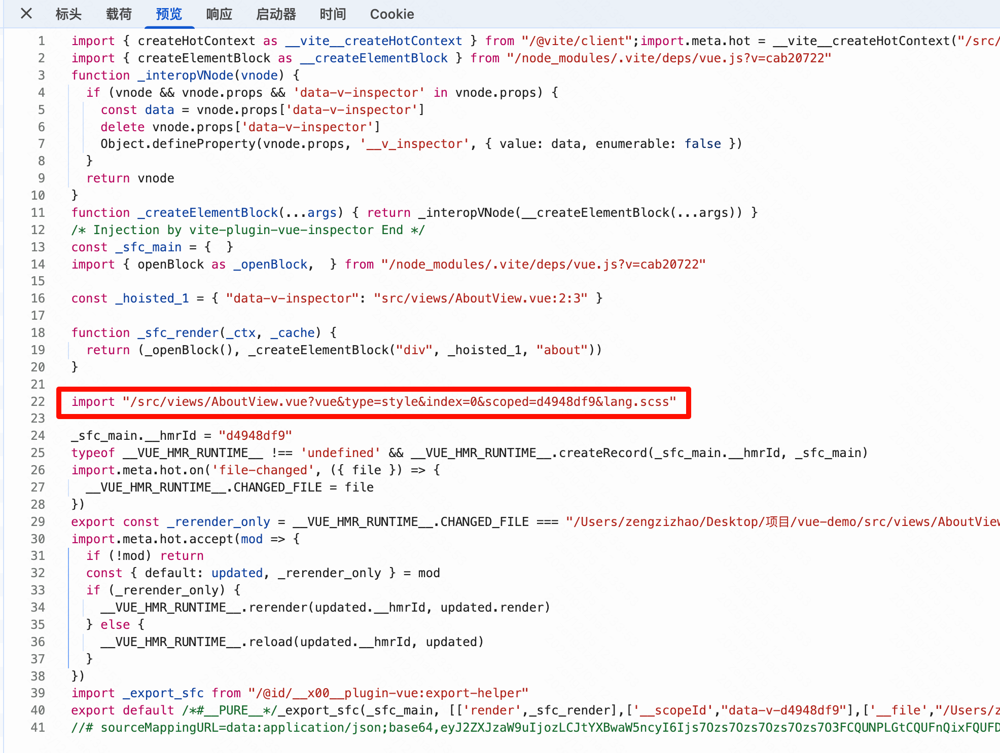

## 页面刷新

### 客户端与服务端建立websocket长连接

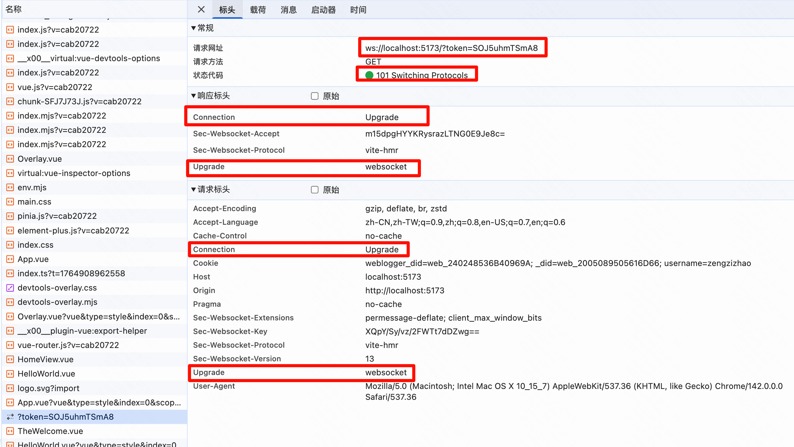

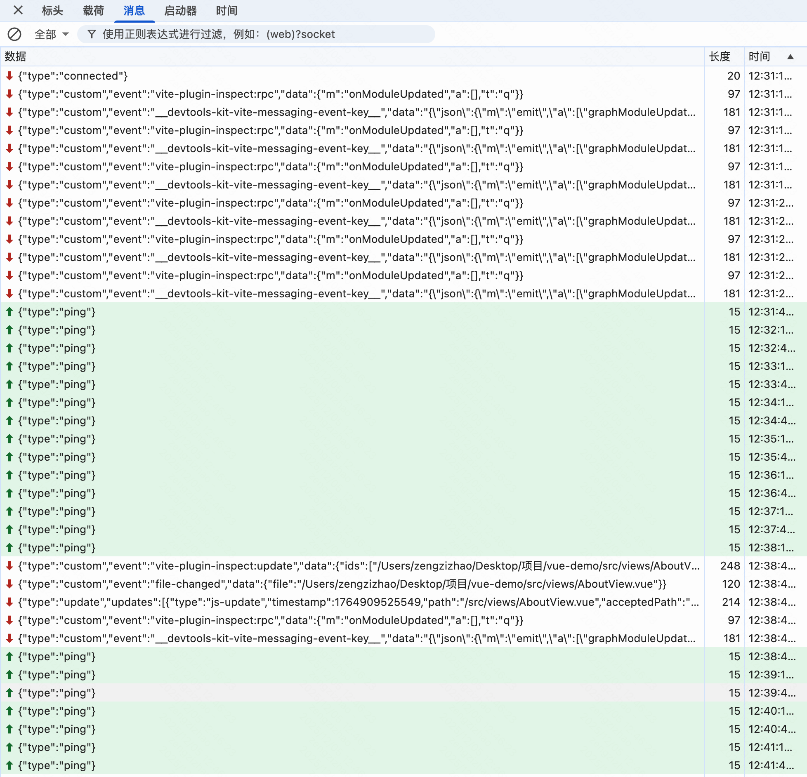

其中数据可以分为以下几类

**刚连接**

**连接后更新模块，发生数据**

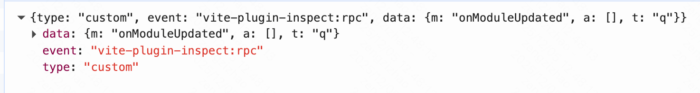

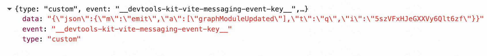

**没有变化，发送心跳**

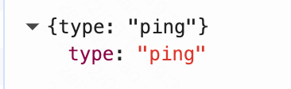

**更新了文件**

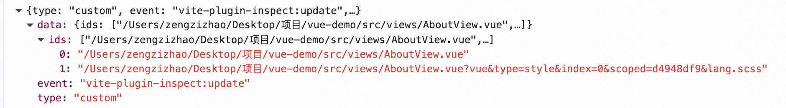

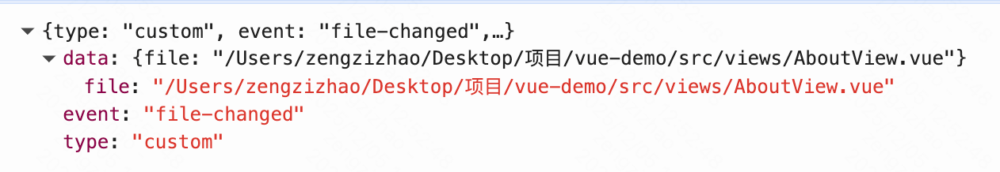

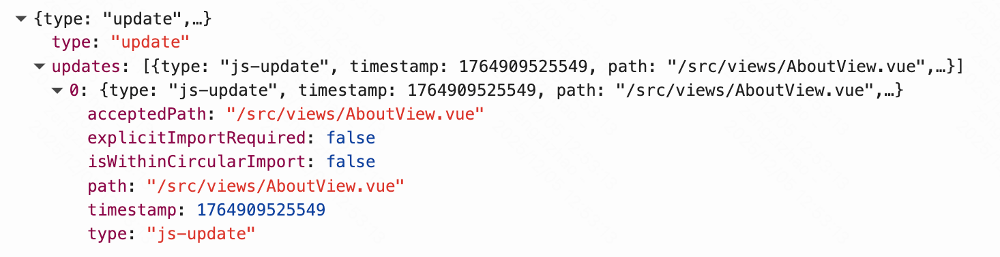

### 页面端注入clinet.js实现不同的更新逻辑

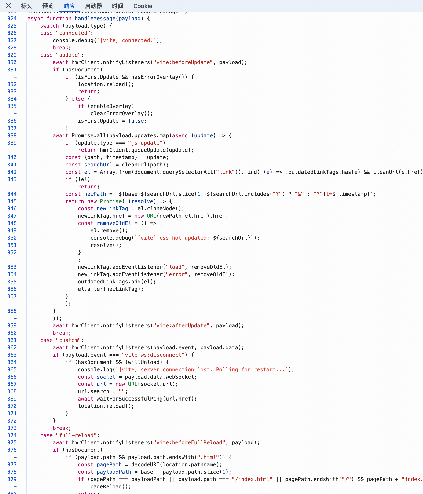