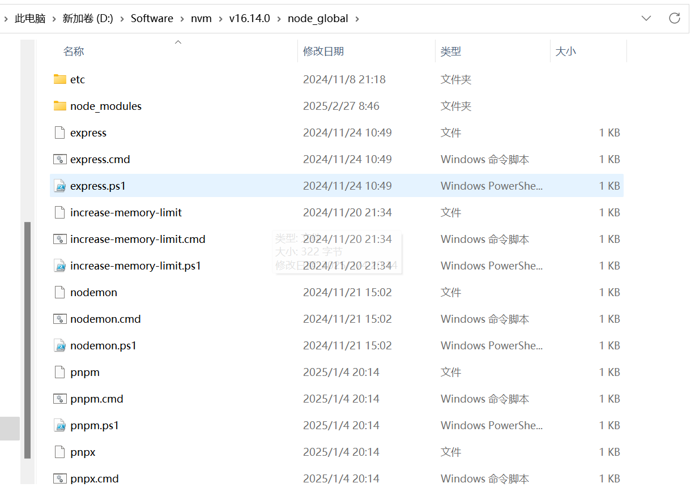
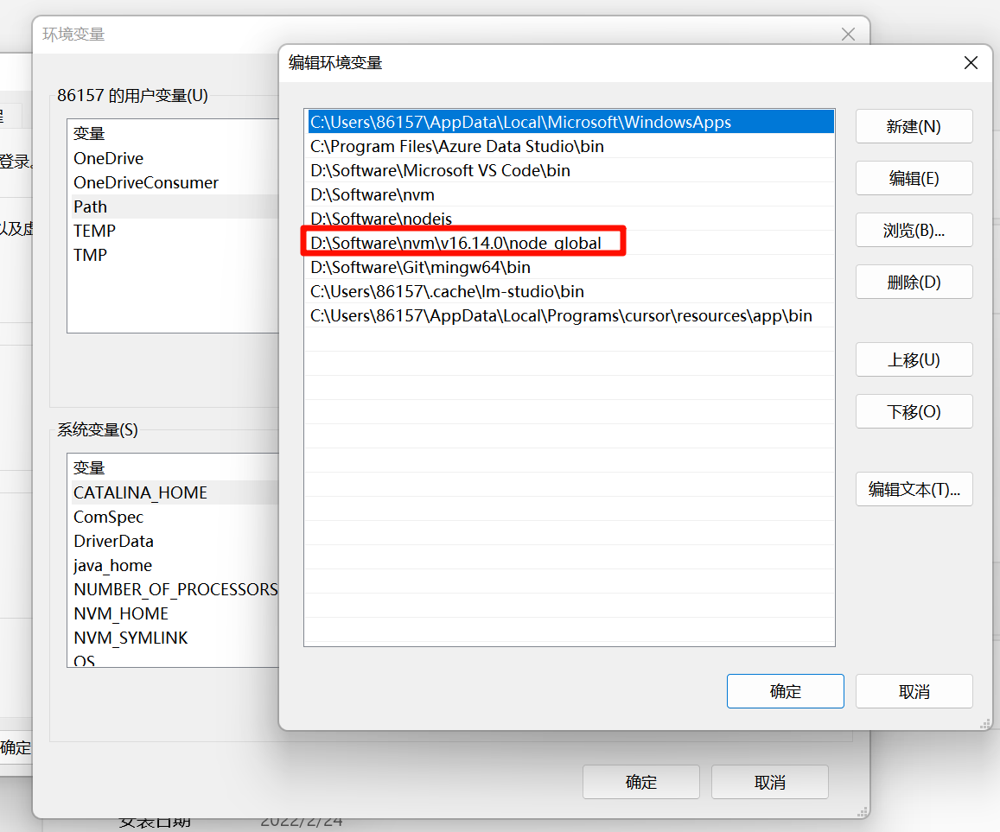

# npm命令

npm config list：列出所有的 npm 配置信息


npm init xxx与npm create xxx是等价，两者只是别名，可以互换使用

> **npm init/create vite@latest背后做的事情：**（vite脚手架工具包名称为create-vite）
>
> 1. 添加create-前缀：如果提供的名字没有以create-开头，npm会自动加上该前缀，这里将vite添加create-前缀形成名称create-vite
>
> 2. 查找官方包并运行，这里是查找名为create-vite的包并运行


# package.json

```json
{
  "name": "唯一标识的包名,普通报名xxx默认公开的,作用域包@xxx/xxx默认私有,需要会员才能发布,也可以配置publishConfig声明为公开包",
  "publishConfig":{
    "access":"public"
  },
  "version": "1.0.0", // 版本号,主版本号.次版本号.修订号
  "private":"是否是私有包",
  "author": "作者",
  "description": "描述信息",
  "keywords": ["关键词，提示SEO"],
  "repository": {
    // 代码托管位置
    "type": "git",
    "url": "https://github.com/xxx/shang-utils"
  },
  "license": "许可证",
  "homepage": "包的主页或者文档首页",
  "bugs": "用户问题反馈地址",
  "files":["指定推送到npm服务器上的文件是哪些"],
  “typings”:"指定typescript的入口文件",
  “types”:"指定typescript的入口文件,与typings配置一个即可",
  "main": "该包被CMJ方式引入时的入口文件",
  "module":"该包被ESM方式引入时的入口文件",
  "exports":{
    // 声明被引入时各个方式下的入口文件，优先级大于上面的mian、module
    ".":{
      "import":"该包被ESM方式引入时的入口文件",
      "require":"该包被CMJ方式引入时的入口文件",
      "types":"指定typescript的入口文件"
    }
  },
  "sideEffects":"告诉打包器在tree shaking时哪些文件在import时是有副作用的，即使没有使用也不能删除进行tree shaking",
  "scripts": {
    // 存放可执行脚本
    "test": "echo \"Error: no test specified\" && exit 1"
  },
  "dependencies": {
    // 运行依赖
  },
  "devDependencies": {
    // 开发依赖
  }
}

```


# 下载使用包

## 全局包

可以直接通过命令行运行的包命令，通过npm i xxx -g来安装

当前设备全局包存放路径



为什么全局包可以直接在命令行通过命令运行呢：因为系统环境变量中有全局包的位置，所以命令行可以找到该命令，故可以直接通过命令行运行命令



## npx

npx是一个命令行工具，它是npm 5.2.0版本中新增的功能。它允许用户在不安装全局包的情况下，运行已安装在本地项目中的包或者远程仓库中的包。

解决问题：节省磁盘空间、使用最新版本的包

命令：npx 要运行的命令

查找规则如下

- 先从当前项目的node_modules/.bin去查找可执行命令xxx
- 如果没找到就去全局的node_modules 去找可执行命令xxx
- 如果还没找到就去npm官网上下载，之后用完之后删除 

### 使用npx的例子——以nodemon为例子

使用命令npm ls -g查看当前安装的全部包可知，当前并没有全局安装nodemon包

**方案1**

npm i nodemon -g全局安装nodemon后，使用nodemon xxx

**方案2**

npx nodemon xxx运行

## package-lock.json

作用：

- 锁定版本记录依赖树详细信息
- 做缓存：通过`name + version + integrity` 信息生成一个唯一的key，这个key能在npm_cache 下的_cache下的index-v5 下的找到对应的缓存记录，如果发现有缓存记录，就会找到tar包的hash值，然后将对应的二进制文件解压到node_modeules


## npm包格式

发展时间线：IIFE-->AMD-->CJS-->UMD-->ESM

作为npm包作者，只要处理ESM、CJS格式就行了，对于ts版本则再加一个.d.ts的类型声明文件

**ESM**

ESModule格式，官方标准，支持tree-shaking

在现代浏览器、node大于14的环境都可以使用

**CJS**

CommonJs格式，不支持tree-shaking

在node环境中可以使用

**AMD**

浏览器的第一代模块系统，使用Requirejs

**IIFE**

立即执行函数

通过`<script>`标签直接使用

**UMD**

Universal Module Definition

对上述CJS、AMD、IIFE进行统一处理，通过判断当前所处环境，用对应的方式暴露导出


# npm运行package.json中的脚本

## npm run xxx脚本发生了什么

读取package json 的scripts 对应的脚本命令的内容，之后按照如下规则去查找该命令

- 先从当前项目的node_modules/.bin去查找可执行命令xxx
- 如果没找到就去全局的node_modules 去找可执行命令xxx
- 如果还没找到就去环境变量查找
- 再找不到就进行报错

由于nodejs 是跨平台的所以可执行命令兼容各个平台，有三类对应的文件：.sh，.cmd，.ps1

- .sh文件是给Linux unix Macos 使用
- .cmd 给windows的cmd使用
- .ps1 给windows的powerShell 使用


如果是使用pnpm，运行`package.json`中的`script`脚本时可以省略`run`，直接运行脚本

## npm的生命周期

```json
"predev": "node prev.js",
"dev": "node index.js",
"postdev": "node post.js"
```

执行 npm run dev 命令的时候 predev 会自动执行，它的生命周期是在dev之前执行，然后执行dev命令，再然后执行postdev

运用场景：npm run build 可以在打包之后删除dist目录，post例如你编写完一个工具发布npm，那就可以在之后写一个脚本顺便帮你推送到git

**内置预设钩子**

prepare：安装依赖前、npm publish前，执行npm run prepare运行该脚本


# npm发包

## 使用changeset管理变更集

安装

```bash
npm i @changesets/cli
```

初始化

```bash
pnpm changeset init
```

运行初始化后，会在根目录下创建一个`.changeset`文件夹，包含配置文件`config.json`

完成一个功能/修复后，创建changeset添加变更记录

```bash
pnpm changeset
```

之后会交互式提示问你选择要发布的包、选择版本类型、输入变更描述。之后会在`.changeset`文件夹下生成一个`xxx.md`文件记录变更。可以累计多个变更记录直到想要发布时再进行消费。

发布前，消费所有changeset并自动根据changeset更新package.json中的version版本，同时生成/更新`CHANGELOG.md`

```bash
pnpm changeset version
```

提交到git仓库

```bash
git add .
git commit -m 'xxx'
```

发布更新包

```bash
pnpm run build
pnpm changeset publish
# pnpm changeset publish自动给上一步的commit打上当前版本的tag
```

推送到远程仓库

```bash
git push && git push --tags
```


## github actions实现CICD自动发包

**workflow** ：持续集成一次运行的过程，就是一个 workflow。

**job** ：一个 workflow 由一个或多个 jobs 构成，同一个job的各个step在同一台机器、文件系统，不同job是不同机器，互相隔离。

**step**：每个 job 由多个 step 构成，一步步完成。

**action** ：每个 step 可以依次执行一个或多个命令（action）。

GitHub Actions的配置文件叫做workflow文件，存放在代码仓库的`.github/workflows`目录。workflow 文件采用YAML格式，文件名可以任意取，后缀统一为`.yml`

```yaml
# workflow的名称。如果省略该字段，默认为当前workflow的文件名
name: Release
# 指定触发workflow的条件
on:
  push: # push事件触发workflow
    branches:
      - main # 只要在main分支上push才出发workflow

# workflow文件的主体是jobs字段，表示要执行的一项或多项任务
jobs:
  release:
    name: Release # name就是job任务说明
    runs-on: ubuntu-latest # 运行所需要的虚拟机环境
		
		# steps字段指定每个Job的运行步骤，可以包含一个或多个步骤
    steps:
      - name: Checkout Branch # name就是steps步骤说明
        uses: actions/checkout@v4 # 使用写好的actions(owner/repo@ref),actions/checkout@v4表示GitHub 官方账号 actions下的checkout仓库,使用v4这个版本

      - name: Install pnpm
        uses: pnpm/action-setup@v2
        with: # 给uses的action传递参数
          version: 10

      - name: Use Node.js 22
        uses: actions/setup-node@v4
        with:
          node-version: 22
          cache: pnpm

      - name: Install Dependencies
        run: pnpm install # 在终端执行该shell命令

      - name: Build Packages
        run: pnpm run build

      - name: Publish to npm
        id: changesets
        uses: changesets/action@v1
        with:
          publish: pnpm changeset publish #  无 changeset的xxx.md 时执行的发布命令
        env: # 给当前step设置环境变量
          GITHUB_TOKEN: ${{ secrets.GITHUB_TOKEN }} # 用于创建 PR
          NPM_TOKEN: ${{ secrets.NPM_TOKEN }} # 用于发布到 npm
```

其中GITHUB_TOKEN有github action自动提供，但需要给github action配置权限，步骤如下

1. 该仓库 Settings → Actions → General
2. 滚动到 Workflow permissions
3. 选择 Read and write permissions
4. 勾选 Allow GitHub Actions to create and approve pull requests
5. 点击 Save

其中NPM_TOKEN需要自己先去npm官网上建立一个access tokens，然后将该token配置到仓库中，配置步骤如下：

1. GitHub 仓库 → Settings → Secrets and variables → Actions
2. 点击 New repository secret
3. Name 填 NPM_TOKEN，Value 填刚才的 token

action的工作流程：

1. 开发阶段：本地运行 pnpm changeset 添加变更记录生成一个changeset的xxx.md文件
2. 推送到 main：GitHub Actions 自动运行
3. changesets/action 检测到 changeset 的 xxx.md 文件：action 运行 changeset version 更新 package.json 中的版本号、更新 CHANGELOG.md、创建一个名为 "Version Packages" 的 PR，同时删除该 changeset 的 xxx.md 文件
4. 我们审核该 PR 合并到 main 后再次触发 Action，由于本次无 changeset 的 xxx.md 文件，执行 publish 命令，运行配置的 pnpm changeset publish 发布脚本，发包到 npm，同时自动创建 GitHub Release 和 Git Tag

> 如果当前不想发布，单纯为了更新远程仓库，则不必运行pnpm changeset直接常规流程push即可。不会导致 changeset 的 action 进行上述 PR 和发包的操作。因为直接push时package.json中的版本号并没有改变，所以不会发包。而合并 PR 时，版本号已被 PR 更新，所以会发包。

