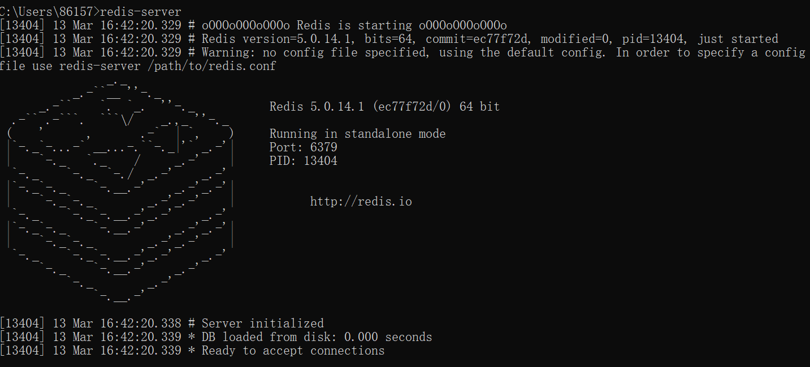
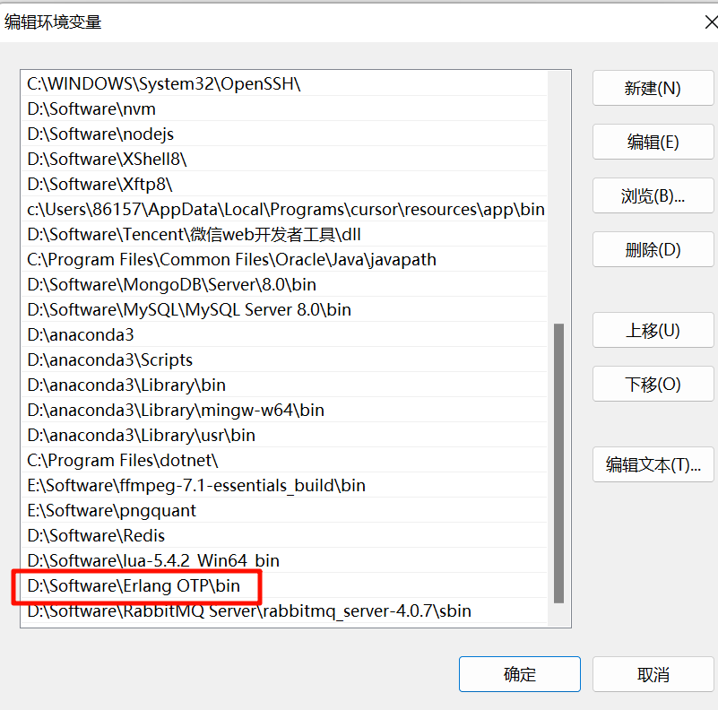
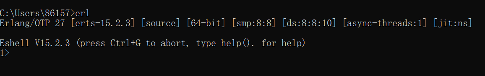
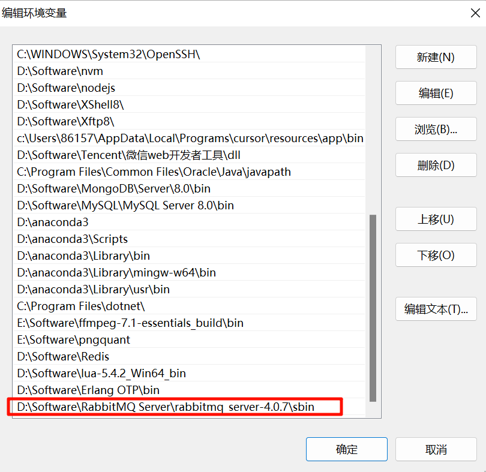
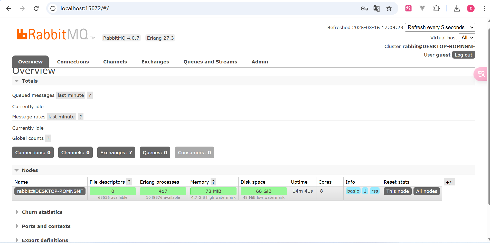

# BFF

BFF即Backends For Frontends，服务于前端的后端，是一种架构模式，为前端应用与后端微服务之间引入一个中间层。

可以起到性能优化的作用，在微服务架构下，一个页面可能需要调用多个后端服务，BFF可以将这些调用聚合起来，让前端一次请求就可以获取所有必要数据


# 全局变量

```js
定义全局变量
global.xxx = 'xxx'
```

在浏览器中全局变量在window中，nodejs在global，不同的环境还需要判断，于是在ECMAScript 2020 出现了一个globalThis全局变量，在nodejs环境会自动切换成global ，浏览器环境自动切换window

```js
globalThis.xxx = 'xxx'
```


```js
执行该脚本的目录的绝对路径
__dirname
执行该脚本的文件的绝对路径
__filename
```

# SSR，CSR

nodejs中没有DOM和BOM，但是ECMAscriptAPI基本都能用

但是如果非要操作DOM 和 BOM 也是可以的，需要第三方库`jsdom`，通过该库可以让请求数据和拼装和页面渲染都在服务端完成，所以也称为SSR `（Server-Side Rendering）`

而Vue,react 等框架，是在客户端完成渲染拼接的属于CSR`（Client-Side Rendering）`

# 基础模块

模块内的xxx异步方法，通过回调函数进行后续操作

模块内的xxxSync是同步方法

## path

```js
path.basename('xxx')：返回给定路径的最后一部分（文件名）
path.dirname('xxx')：返回给定路径的目录名（除了最后文件名一部分外）
path.extname('xxx')：返回路径的扩展名（带点的）
path.join('xxx','xxx','xxx')：拼接路径

path.resolve()：解析路径，返回绝对路径
多个绝对路径，返回最右边的绝对路径
console.log(path.resolve('/a','/b'));
D:\b
一个相对路径，返回当前工作目录的绝对路径
console.log(path.resolve('./index.js'));
D:\Web\XioaManLearn\node\index.js
一个绝对路径和一个相对路径，将绝对路径与相对路径拼接得到的相对路径
console.log(path.resolve(__dirname,'./index.js'));
D:\Web\XioaManLearn\node\index.js

path.parse('xxxx')：将文件路径解析为对象
path.format({xx:xx,xx:xx})：将对象转为文件路径
path.sep：当前系统的路径分隔符
```


# 流

传统上，开发者一次性将整个数据集读入内存；而node流通过以可管理的块chunk为单位增量式地处理数据，优化内存使用

node中的流继承自EventEmitter类，在数据处理的各个阶段发出事件，开发者监听这些事件执行自定义逻辑进行处理


# ffmpeg

FFmpeg 是一个开源的跨平台多媒体处理工具，可以用于处理音频、视频和多媒体流。它提供了一组强大的命令行工具和库，可以进行视频转码、视频剪辑、音频提取、音视频合并、流媒体传输等操作。

官网下载对应平台对应的ffmpeg后将其添加到系统变量中即可通过命令行运行


## 基本格式转换

avi，mp4，gif

配合子进程模块

可以用于给前端提供一个转为gif的功能，将后缀改为.mp3则可以改为提取视频中的音频

```js
const {execSync}=require('child_process')
-i表示输出
execSync('ffmpeg -i test.mp4 test.gif')
```

## 裁剪视频

```bash
ffmpeg -ss 开始时间 -to 结束时间 -i test.mp4 test2.mp4
```

## 加水印

```bash
ffmpeg -i test.mp4 -vf drawtext=text="水印文字":fontsize=水印文字字体大小:x=水印文字x坐标:y=水印文字y坐标:fontcolor=水印文字颜色 test3.mp4
```

## 去除水印

```bash
ffmpeg -i test3.mp4 -vf delogo=w=宽:h=高:x=x坐标:y=y坐标 test4.mp4
```

# pngquant

pngquant是一个用于压缩 PNG 图像文件的工具（只能用于png图片）。它可以显著减小 PNG 文件的大小，同时保持图像质量和透明度。通过减小文件大小，可以提高网页加载速度，并节省存储空间。

官网下载对应平台对应的pngquant后将其添加到系统变量中即可通过命令行运行


```bash
普通压缩
pngquant test.png --output test1.png

带质量参数的压缩，0-100数字越高质量越好、体积越大
pngquant test.png --quality=80 --output test1.png

带速度参数的压缩，1-10数字越小越慢但是质量高
pngquant test.png --speed=1 --output test1.png
```


# redis

windows安装：https://blog.csdn.net/m0_74824112/article/details/145656842

去https://github.com/tporadowski/redis/releases下载`.msi`或`.zip`类型的文件

> .msi与.zip格式的区别：
>
> .msi是Windows的程序安装文件，可以让你安装，修改，卸载你所安装的程序。说白了.msi就是程序数据包，把所有和安装文件相关的内容封装在一个包里。此外：它还包含有关安装过程自己的信息。例如：安装序列、目标文件夹路径、安装选项和控制安装过程的属性。通过该文件下载时需要一步一步选择自己的配置安装
> .zip是一个压缩包，解压之后即可使用，不需要安装

我下载`.zip`后将其放在D盘的Software文件夹下的Redis文件夹中，并将其路径放入到了环境变量中

通过命令行使用命令`redis-server`启动`redis`服务



启动后该命令行不能关闭，要一直作为服务器端打开共连接redis

另启一个命令行，通过命令行使用命令`redis-cli`启动客户端连接redis服务器端

# RabbitMQ

## erlang环境

RabbitMQ基于erlang语言开发，所以在安装RabbitMQ之前需要先安装其依赖环境erlang

官网下载erlang后添加环境变量



之后在命令行输入erl后显示如下则安装成功



## 安装RabbitMQ

在官网上安装后配置环境变量



## MQ可视化面板

安装MQ可视化面板插件

```bash
rabbitmq-plugins enable rabbitmq_management
```

启动MQ，MQ默认端口`5672`

```bas
rabbitmq-server.bat start
```


启动后不要关闭该命令行

可视化面板在15672端口，访问 http://localhost:15672/#/ 进入可视化面板，账号密码都是 `guest`



之后操作MQ可见官网


# 部署

## PM2

PM2：process manager2，管理node.js进程的工具

虽然使用node app.js也能跑起来一个应用，但是存在以下问题：终端一关应用就停；服务器重启应用无法自动重启；不能多核跑等
