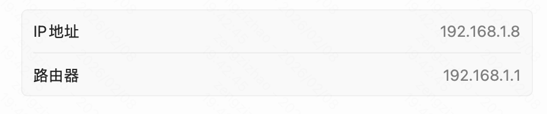
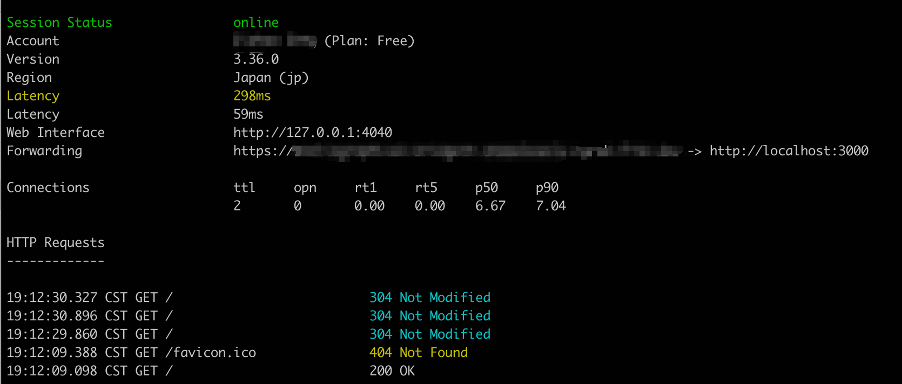

# 同一个局域网下互相访问

查看电脑在当前局域网下的ip

```bash
ipconfig getifaddr en0
```


或者打开设置的Wi-Fi，点击当前所连接的网络的网络设置，即可查看到电脑在当前局域网下的ip



之后就可以在其他设备上通过该ip+端口访问电脑上的服务程序了

# ngrok

ngrok是一个内网穿透工具，将本地电脑上的服务暴露在公网，生成一个外网可访问的url

工作原理：ngrok在本地服务与ngrok的服务器之间建立安全隧道，提供一个外网可访问的url映射到本地对应端口服务，访问url的流量都会被转发到本地服务上

## 下载与配置

[官网安装教程](https://dashboard.ngrok.com/get-started/setup/macos)

先在官网上安装ngrok，解压后会得到一个ngrok的命令行工具，将其移动到`/usr/local/bin`目录中

使用如下命令，将身份验证令牌添加到默认的ngrok.yml中

```bash
ngrok config add-authtoken 从官网上获取的token
```

在本地启动一个端口服务

在终端运行`ngrok http 映射的本地端口`，得到如下结果



其中，Forwarding为ngrok提供的可供外网访问的域名，以及其映射的本地服务；Web Interface为ngrok服务的控制台面板