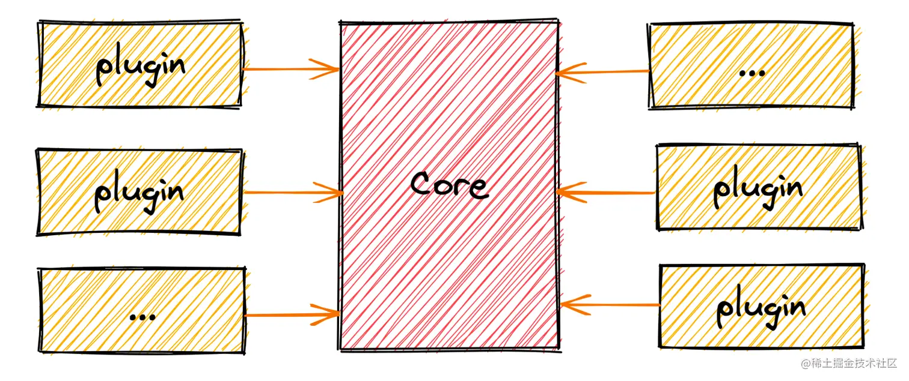
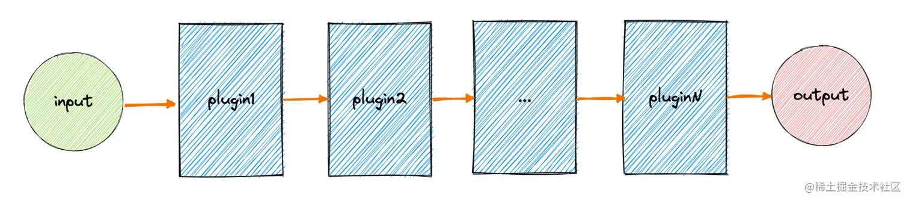
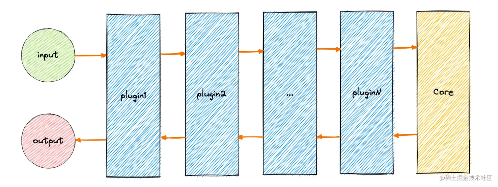
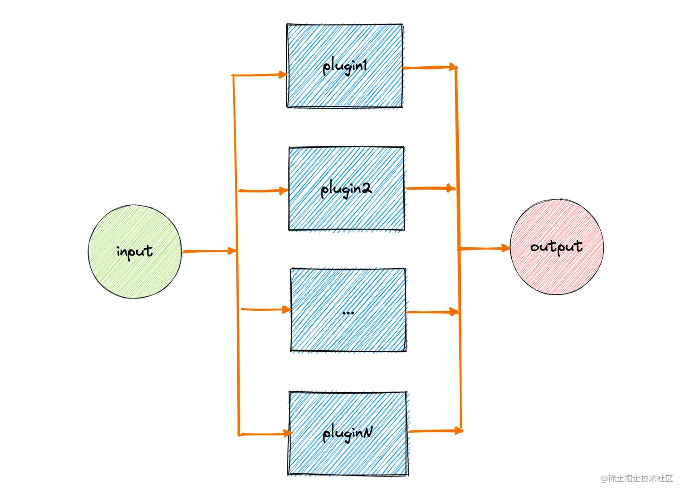

[原文](https://juejin.cn/post/7163078031601303583)

# 基本思想

微内核架构由Core（负责基础核心功能、插件管理）+Plugin（插件系统，每个插件作为一个独立的功能模块，按需扩展功能）

内核Core与插件plugin是解耦的，不使用插件的情况下内核也可以独立运行。




# 简单实现

## Core与Plugin的实现

```ts
// 插件类型
interface IPlugin {
    /** 插件名字 */
    name: string;
    /** 插件能力，通常是个函数，也可以叫 apply、exec、handle */
    fn: Function;
}
/** 内核 Core ：基础功能 + 插件调度器 */
class Core {
  	/** 插件注册表 */
    pluginMap: Map<string, IPlugin> = new Map();
    constructor() {
        console.log('实现内核基础功能');
    }
    /** 插件注册，也可以叫 register，通常以注册表的形式实现，其实就是个对象映射 */
    use(plugin: IPlugin): Core {
        this.pluginMap.set(plugin.name, plugin);
        return this; // 方便链式调用
    }
    /** 插件执行，也可以叫 start */
    run() {
        this.pluginMap.forEach(plugin => {
            plugin.fn();
        });
    }
}

// 实现插件1
class Plugin1 implements IPlugin {
    name = 'Block1';
    fn() {
        console.log('扩展功能1');
    }
}
// 实现插件2
class Plugin2 implements IPlugin {
    name = 'Block2';
    fn() {
        console.log('扩展功能2');
    }
}
```

## 调用

```ts
// 内核初始化
const core = new Core();
// 使用插件
core.use(new Plugin1());
core.use(new Plugin2());
// 开始运行
core.run();
```


## 通讯问题，插件内使用内核的功能

通过依赖注入，控制反转，将内核传入插件，在插件中获取Core实例（也叫上下文），从而使用内容的功能

> 依赖注入、控制反转是什么？
>
> 暴露内核给插件的过程就是依赖注入、控制反转
>
> 本来是内核中使用插件，但是我们将内核实例暴露给了插件，变为在插件中使用内核了，这就是通过依赖注入，实现控制反转

对上面Core与Plugin的实现改造后的代码

```ts
interface IPlugin {
    /** 插件名字 */
    name: string;
    /** 插件能力：ctx 就是内核 */
    fn(ctx: Core): void;
}
class Core {
    run() {
        this.pluginMap.forEach(plugin => {
            plugin.fn(this); // 注意这里，我们把 this 传递了进去
        });
    }
}
```

这样实现后插件可以使用到内核的功能，但是参与不到整个内核运行的生命周期过程中来。所以引入事件机制（发布订阅模式），在内核执行过程中抛出事件，插件监听相应的事件（其中事件可以称为events，也可以像webpack一样称为hooks）。对上面的代码继续改造

```ts
import { EventEmitter } from 'events'; // webpack 中使用 tapable，很强大的一个发布订阅库

class Core {
    events: EventEmitter = new EventEmitter(); // 也可以叫 hooks，就是发布订阅
    constructor() {
        this.events.emit('beforeInit');
        console.log('实现内核基础功能');
        this.events.emit('afterInit');
    }
    run() {
        this.events.emit('before all plugins');
        this.pluginMap.forEach(plugin => {
            plugin.fn(this);
        });
        this.events.emit('after all plugins');
    }
}

// 插件中可以这样调用：ctx.events.on('xxxx',fn);
```


## 插件的调度，执行顺序

插件执行顺序有如下几种：

**管道式：插件顺序执行**



**洋葱式：**像node框架Egg、Koa、Express，每个中间件相当于这里的插件，路由经过层层中间件，又层层返回；还有babel遍历过程中访问器vistor的进出过程也是如此



**集散式**



## 插件的注册方式

**声明配置式**

通过配置文件对应的配置选项处声明

**编程调用式**

内核提供注册api，开发者将插件插入该api完成注册


# 应用场景

## webpack

```ts
const pluginName = 'ConsoleLogOnBuildWebpackPlugin';

class ConsoleLogOnBuildWebpackPlugin {
  // apply相当于我们之前实现的fn方法，就是插件核心能力的函数
  // compiler就是依赖注入、控制反转传入的打包器的内核上下文
  apply(compiler) {
    // compiler.hooks.run.tap('xx',fn)相当于发布订阅ctx.events.on('xx',fn)
    compiler.hooks.run.tap(pluginName, (compilation) => {
      console.log('The webpack build process is starting!');
    });
  }
}

module.exports = ConsoleLogOnBuildWebpackPlugin;
```

